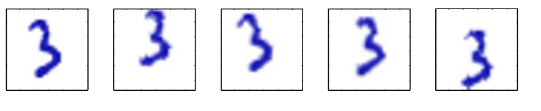

+++
title = '[Deep Learning: Foudations and Concepts] CH16-Continuous Latent Variables'
date = 2025-06-30T16:08:03+08:00
draft = true
math = true
summary = ""

+++

本文内容来自 [Deep Learning: Foundations and Concepts](https://www.bishopbook.com/) 一书的第十六章。

正文的数学公式会尽可能简洁，某些公式的详细推导过程在 Appendix 中给出。

应当注意的是本文只是博主在学习过程中对于原书内容的摘要性记录，并不能完全代替原书内容。

## CH16 Continuous Latent Variables

什么是潜在变量（Latent Variables）？

这个概念主要是相对于高维数据而言的，对于很多高维数据，我们可以认为它们实际上是由一些低维的潜在变量控制。举个例子，对于手写数字图片（见下图），一般而言我们会认为每一个像素点都是一个维度，假如整个图片有 100x100 个像素，那么每个图片都是一个高达 10000 维的数据。但是换个角度思考，我们可以认为这些图片实际上是由第一张图片经过一些变化，例如平移和旋转得到的。让我们暂时忽略数字部分在像素级别的细微差异，我们是否可以认为，以下五张图片实际上是由三个变量（纵向平移，横向平移，中心旋转）所控制的呢？完全可以，此时我们可以认为这几张图片是由这三个潜在变量控制生成的，因为你只要拿到第一张图片，然后通过修改这三个变量，就可以得到后续所有的图片。而在观测数据中我们只能看到像素，而看不到控制生成过程的三个变量，所以这些变量就称之为潜在变量。

上面的例子也许不是很严谨，例如控制生成过程的也许还有好多个其他的潜在变量，但是我们主要关注这种思想。实际上现实中绝大多数数据都符合这种特点，**即高维的数据往往集中在某些低维流形上，且其维度远小于原始数据维度**。此时我们就可以通过这些低维流形所代表在潜在变量来生成一些数据，但是生成的数据往往和现实不太一致，因为现实数据往往带有噪音。因此我们在生成的数据上添加一些噪音，从而使其更加接近观测数据。

>  这个过程很自然的启发了一些生成式模型。

而要从观测数据中找到控制其生成过程的潜在变量，我们就需要想办法抛弃无用的维度，将高维的观测数据降维到真正的低维流形上。

### 16.1 Principal Component Analysis

主成分分析（PCA）是一种非常常用的降维手段，也被称之为 Kosambi–Karhunen–Loeve transform。PCA 有两种定义，一是最大化投影后数据方差的线性投影；二是最小化投影代价的线性投影，投影代价通常定义为投影前后数据的均方距离。我们会从两个角度分别尝试推导出 PCA 的数学过程。

> 所有推导过程以单变量为基础，多变量降维请参考 canonical correlation analysis。

#### 16.1.1 Maximum variance formulation

我们有 $N$ 个观测数据  $\{\mathbf{x}_n\}=\{\mathbf{x}_1,\dots,\mathbf{x}_N\}$ ，每个数据由一个 D 维向量表示，即  $\mathbf{x}_i\in \mathbb{R}^D $  。我们希望将其降维到一个 $M$ 维空间中（$M<D$），即每个数据点使用 $M$ 维向量表示。通常而言 $M$ 是给定的，后面我们会讨论一些选择 $M$ 的技巧。

现在考虑一个简单情况，即 $M=1$。我们希望将数据投影到一条线上，我们可以使用一个向量 $\mathbf{u}_t$ 来表示，而且我们关注的是向量的方向，而不在乎其长度，因为这个向量代表的是我们所要投影到的一维空间方向，至于这个向量到底多长，我们并不在乎，所以我们规定  $\mathbf{u}_t^T\mathbf{u}_t=1$ 。投影后的向量就可以表示为  $\mathbf{u}_t\mathbf{x}_n$ ，此时我们不难求出投影后数据的均值为  $\mathbf{u}_t^T\bar{\mathbf{x}}$ ，方差为  $\mathbf{u}_t^T \mathbf{S}\mathbf{u}_t$ 。

> 均值和方差的推导见 Appendix A1.1~A1.2。

我们要最大化投影后数据的方差，即  $\max \mathbf{u}_t^T \mathbf{S} \mathbf{u}_t$ ，但是可能出现  $\mathbf{u}_t^T \mathbf{S} \mathbf{u}_t =a$ ，有  $\hat{\mathbf{u}}_t=k\mathbf{u_t}$ ， 令  $\hat{\mathbf{u}}_t^T \mathbf{S} \hat{\mathbf{u}}_t=k^2\mathbf{u}_t^T \mathbf{S} \mathbf{u}_t=k^2 a$  。但我们不想关注向量的长度，因此我们要引入约束项  $\mathbf{u}_t^T\mathbf{u}_t=1$ 。

此时使用拉格朗日乘子法，构建带约束的最大化方程：


$$
\begin{aligned}\mathcal{L}(\mathbf{x},\lambda_1)=\mathbf{u}_t^T\mathbf{S}\mathbf{u}_t + \lambda_1(1-\mathbf{u}_t^T\mathbf{u}_t) \end{aligned}\tag{1.1}
$$


该方程对  $\mathbf{u}_t$  求偏导得：


$$
\mathbf{S}\mathbf{u}_t=\lambda_1\mathbf{u}_t \tag{1.2}
$$


> 求导过程见 Appendix A1.3。

显然投影向量  $\mathbf{u}_t$  是协方差矩阵 $\mathbf{S}$ 的一个特征向量，此时两边左乘  $\mathbf{x}_t^T$  得到投影后的方差  $\mathbf{u}_t^T \mathbf{S}\mathbf{u}_t=\lambda_1$ 。当 $M>1$ 时，令投影后方差最大化的投影向量就是协方差矩阵的前 $M$ 个最大特征值所对应的特征向量。由此我们就推导出了 PCA 降维的数学过程，即对协方差矩阵做特征值分解，从最大的特征值开始选择对应的特征向量，就是降维所需要的投影向量。

但是这种方法的计算量太大，对于维度为 $D$ 的数据，其计算成本为 $O(D^3)$ 。

#### 16.1.2 Minimal error formulation

有 $D$ 维基向量  $\{\mathbf{u}_n\}=\{\mathbf{u}_1,\dots,\mathbf{u}_N\}$ ，满足   $ \mathbf{u}_i^T\mathbf{u}_f = \delta\_{ij}$  ，意思是 $i=j$ 时  $\mathbf{u}_i^T\mathbf{u}_f=1$ ，否则  $\mathbf{u}_i^T\mathbf{u}_f=0$ ，这意味着  $\{\mathbf{u}_n\}$  是一组完全正交的基向量。

对于 $D$ 维的观测数据   $\{\mathbf{x}_n\}=\{\mathbf{x}_1,\dots,\mathbf{x}_N\}$ ，我们可以使用新的基向量做如下转换：


$$
\begin{align}
\mathbf{x}_n=\sum_{i=1}^{D}\alpha_{ni}\mathbf{u}_i
\end{align}\tag{1.3}
$$


这相当于在新的基向量张成的空间中表示观测数据，原始数据 $\mathbf{n}_n$ 的分量  $\mathbf{x}_n=\{x_1,\dots,x_D\}$ ，被替换为  $\{\alpha_1,\dots,\alpha_D\}$ 。此时我们在上式基础上同时左乘某个基向量  $\mathbf{u}_j^T$ ，同时应用基向量之间的正交性，可以得到：


$$
\begin{aligned}
\mathbf{u}_j^T\mathbf{x}_n 
    &= \sum_{i=1}^D \alpha_{ni} \mathbf{u}_j^T \mathbf{u}_i 
    = \alpha_{nj} \\\\
\alpha_{nj} 
    &= \mathbf{u}_j^T \mathbf{x}_n 
    = \mathbf{x}_n^T \mathbf{u}_j
\end{aligned}
\tag{1.4}
$$


我们将公式（1.4）的结果带入公式（1.3），可以改写为：


$$
\begin{align}
\mathbf{x}_n = \sum_{i=1}^D \left( \mathbf{x}_n^T \mathbf{u}_i \right) \mathbf{u}_i
\end{align}\tag{1.5}
$$


此时我们成功使用了自定义的完全正交基向量来表示观测数据，但是我们的目标是对数据进行降维，这意味着我们不能使用全部的 $D$ 个基向量，如果要降到 $M$ 维，那么我们就只能使用其中的 $M$ 个基向量来重新表示，但是选择哪些基向量比较好呢？

假设我们选择了前 $M$ 个基向量，我们可以将观测的数据近似的表示为：


$$
\begin{align}
\tilde{\mathbf{x}}_n = \sum_{i=1}^{M} z_{ni} \mathbf{u}_i + \sum_{i=M+1}^{D} b_i \mathbf{u}_i
\end{align}\tag{1.6}
$$


其中  $\{z_{ni}\}$  依赖于特定的观测数据点，而  $\{b_i\}$  则是对于所有数据点都一致的常量。这种表示下观测数据只有 $M$ 维基向量描述，而公式中的第二项用来补偿降维所失去维度，从而使我们可以在 $D$ 维中表示降维后的数据。

现在我们只需要确定  $z_{ni},\mathbf{u}_i,b_i$  就可以确定降维过程了。该怎么确定呢？答案就在这一小节的标题中，我们要最小化投影前后的数据的投影代价，使用投影前数据和投影后近似数据的距离来描述投影代价。因此我们需要建立如下代价函数：


$$
\begin{align}
J=\frac{1}{N}\sum_{n=1}^N\mid\mid x_n-\tilde{x}_n\mid\mid^2
\end{align}\tag{1.7}
$$


结合公式（1.6）和（1.7），我们将代价函数分别对每个变量求偏导，令偏导为零从而求出使代价函数最小的变量值。首先考虑对  $z_{ni}$ 求偏导，我们可以得到：


$$
\begin{align}
z_{nj}=\mathbf{u}_j^T\mathbf{x}_n,\quad\text{where } j&=1,\dots,M
\end{align}\tag{1.8}
$$


其中 $j$ 是为了避免在推导过程中和 $i$ 混用引起歧义，其含义和 $i$ 类似，表示某个特定基向量，推导过程见 Appendix A1.4~A1.9。

同理我们对  $b_j$ 求偏导可以得到：


$$
\begin{align}
b_j=\bar{\mathbf{x}}^T\mathbf{u}_j,\quad \text{where }j=M+1,\dots,D
\end{align}\tag{1.9}
$$


推导过程见 Appendix A1.10~A1.12。

我们将公式 1.8 和 1.9 代回 1.6，得到


$$
\begin{align}
\tilde{\mathbf{x}}_n=\sum_{i=1}^M(\mathbf{u}_i^T\mathbf{x}_n)\mathbf{x}_n+\sum_{i=M+1}^D(\bar{\mathbf{x}}_n^T\mathbf{u}_i)\mathbf{u}_i
\end{align}\tag{1.10}
$$


此时我们得到了降维后近似变量的表达式，然后我们只要做相减就可以求出原始变量和降维后近似变量的距离。注意我们用公式 1.5 来表示原始变量，这样整个计算都在我们新定义的基向量空间中进行。


$$
\begin{align}
\mathbf{x}_n-\tilde{\mathbf{x}}_n=\sum_{i=M+1}^D\{(\mathbf{x}_n-\bar{\mathbf{x}})^T\mathbf{u}_i\}\mathbf{u}_i
\end{align}\tag{1.11}
$$


详细推导过程见 Appendix A1.13。

这个公式说明了降维前后数据向量的差距都落在了我们选择的 $M$ 维空间中之外，根据该公式我们可以定义 $N$ 个数据点的总投影代价。


$$
\begin{align}
J=\frac{1}{N}\sum_{n=1}^N\sum_{i=M+1}^D(\mathbf{x}_n^T\mathbf{u}_i-\bar{\mathbf{x}}^T\mathbf{u}_i)^2=\sum_{i=M+1}^D\mathbf{u}_i^T\mathbf{S}\mathbf{u}_i
\end{align}\tag{1.12}
$$


推导过程见 Appendix 1.14。

此时我们最小化这个代价函数，同时带有约束  $\mathbf{u}_i^T\mathbf{u}_i=1$ 。我们以 $D=2,M=1$ 为例使用拉普拉斯乘子法。


$$
\begin{align}
J&=\mathbf{u}_2^T\mathbf{S}\mathbf{u}_2\\\\
\tilde{J}&=\mathbf{u}_2^T\mathbf{S}\mathbf{u}_2+\lambda_2(1-\mathbf{u}_2^T\mathbf{u}_2)\\\\
\frac{\partial J}{\partial \mathbf{u}_2}&=\frac{\partial \mathbf{u}_2^T\mathbf{S}\mathbf{u}_2}{\partial \mathbf{u}_2}+\frac{\partial\lambda_2}{\partial \mathbf{u}_2}-\frac{\partial \lambda_2\mathbf{u}_2^T\mathbf{u}_2}{\partial \mathbf{u}_2}\\\\
&=2\mathbf{S}\mathbf{u}_2-2\lambda_2\mathbf{u}_2=0\\\\
\mathbf{S}\mathbf{u}_2&=\lambda_2\mathbf{u}_2
\end{align}
$$


由此可见，降维后的丢弃基向量就是协方差矩阵的特征向量的一部分，我们将其推广到 $M$ 维可以得到  $J=\sum_{i=M+1}^D\lambda_i$ ，因此我们只需要抛弃最小的特征值所代表的基向量，就可以令投影代价最小化。

#### 16.1.3 Data compression

这一章节简要描述了 PCA 在数据有损压缩中的一些应用，并对如何看待降维后的近似变量提供了一种新的看法，即降维后的数据实际上是原始数据的均值加上我们给定的 $M$ 个自由度来描述压缩后的数据，因此压缩后数据的信息量完全取决于这 $M$ 个维度的信息，所以 $M$ 越大，保留的信息就越多，就越像原始数据。

#### 16.1.4 Data whitening

数据白化其实不属于降维，而是数据预处理的一种，其效果类似于标准化或者归一化，即把数据的某些数量级差距过大的属性转为数据量近似的表示方法。

#### 16.1.5 High-dimensional Data

这一节概述了如何对高维数据做 PCA，因为做 PCA 的复杂度和数据维度 $D$ 的三次方成正比，因此直接对高维数据进行 PCA 的成本是难接受的，这一章节描述了一种将 PCA 转入原始数据的某一个低维空间中进行处理的方法。

> 我平常不使用 PCA，因此这一节就大概看了一下。

### 16.2 Probabilistic Latent Variables

上一节中我们介绍了 PCA，一种通过线性映射将高维数据变化到低维空间中的方法。更详细一点说是使用一组低维基向量的线性组合来近似表示高维数据，而线性组合的系数  $z_{ni}$  被看作是一组确定的潜在变量。一组潜在变量可以描述对应的高维的观测数据，也可以理解为所有的高维观测数据都是从不同的潜在变量组合中生成的，由此引入了生成式模型的一些概念。但是现在这些潜在变量都是确定的值，因为他们是基向量的系数。但是如果潜在变量是一个联系概率分布呢？

如果我们使用最大似然来表示一个使用概率潜在变量的 PCA，那就叫 Probabilistic PCA。它有以下几个有点：

* 是一种受限高斯分布，限制了自由参数的数量，但是模型仍然可以捕捉数据中的主要相关性。
* 可以通过生成的方式运行，从分布中提供样本。
* 为 PCA 的贝叶斯处理奠定了基础，使得主子空间的维度可以自动从数据中确定。

> 实际上书中给出了八条优点，但我觉得这三条最重要，可惜这三条我也没有完全理解。

#### 16.2.1 Generative model

我们首先定义 $M$ 维的潜在变量 $\mathbf{z}$ ，然后定义高斯先验 $p(\mathbf{z})$ 和对应的以 $D$ 维观测数据 $\mathbf{x}$ 作为条件的高斯条件分布 $p(\mathbf{z}|\mathbf{x})$ 。

具体而言，我们将高斯先验定义为标准高斯分布。


$$
\begin{align}
p(\mathbf{z})=\mathcal{N}(\mathbf{z}\mid\mathbf{0},\mathbf{I})
\end{align}\tag{2.1}
$$


同样的，观测数据是潜在变量的线性变化，因此有


$$
\begin{align}
p(\mathbf{x}\mid\mathbf{z})=\mathcal{N}(\mathbf{x}\mid\mathbf{Wz}+\boldsymbol{\mu},\sigma^2\mathbf{I})
\end{align}\tag{2.2}
$$



其中 $\mathbf{W}$ 是一个 $D\times M$ 的矩阵，表示线性变换，实际上其列向量所张成的空间就代表了主子空间，而 $\boldsymbol{\mu}$ 则对均值进行了偏移。$\sigma$ 对条件分布的方差进行了缩放。我们可以生成式模型的角度来看待 probabilistic PCA，即首先从标准高斯分布中采样潜在变量 $\mathbf{z}$ ，然后在该潜在变量控制的条件分布上采样生成观测数据 $\mathbf{x}$ 。具体而言，观测数据是潜在变量的线性变化然后加上了一点高斯噪声，数学描述为：


$$
\begin{align}
\mathbf{x}=\mathbf{Wz}+\boldsymbol{\mu}+\boldsymbol{\epsilon}
\end{align}\tag{2.3}
$$


其中 $\mathbf{z}$ 是 $M$ 维潜在变量，$\boldsymbol{\epsilon}$ 是 $D$ 维均值为零，方差为 $\sigma^2\mathbf{I}$ 的高斯噪声。

#### 16.2.2 Likelihood function

根据公式 2.3 的描述，如果我们想要生成数据，那么我们就需要确定 $\mathbf{W},\boldsymbol{\mu},\sigma$ 这几个量。通过最大似然法，我们首先写出 $\mathbf{x}$ 的边缘概率分布。


$$
\begin{align}
p(\mathbf{x})=\int p(\mathbf{x}\mid\mathbf{z})p(\mathbf{z})d\mathbf{z}
\end{align}\tag{2.4}
$$



高斯分布的线性变换依然是高斯分布，因此我们可以定义


$$
\begin{align}
p(\mathbf{x})&=\mathcal{N}(\mathbf{x}\mid\boldsymbol{\mu},\mathbf{C})\tag{2.5}\\\\
\mathbf{C}&=\mathbf{WW^T}+\sigma^2\mathbf{I}\tag{2.6}
\end{align}
$$



这个分布的均值和协方差矩阵推导如下


$$
\begin{align}
\mathbb{E}[\mathbf{x}]&=\mathbb{E}[\mathbf{Wz}+\boldsymbol{\mu}+\boldsymbol{\epsilon}]=\boldsymbol{\mu}\tag{2.7}\\\\
\text{cov}[\mathbf{x}]&=\text{cov}[\mathbf{Wz}+\boldsymbol{\epsilon}]\\\\
&=\mathbb{E}[(\mathbf{Wz}+\boldsymbol{\epsilon})^\mathbf{T}(\mathbf{Wz}+\boldsymbol{\epsilon})]\\\\
&=\mathbb{E}[\mathbf{WzzW}^\text{T}]+\mathbb{E}(\boldsymbol{\epsilon\epsilon}^\text{T})\\\\
&=\mathbf{WW}^\text{T}+\sigma^2\mathbf{I}\tag{2.8}
\end{align}
$$



推导过程中使用了 $\mathbf{z}$ 和 $\boldsymbol{\epsilon}$ 相互独立的特性。

> 你也许发现一开始定义的边缘概率积分似乎不需要，我也这么觉得。

现在我们使用了三个变量 $\mathbf{W},\boldsymbol{\mu},\sigma$ 来表示了观测数据分布，但其实这些变量仍然有一些冗余。为了说明这个问题，我们一个矩阵 $\tilde{\mathbf{W}}=\mathbf{WR}$，其中 $\mathbf{R}$ 是一个正交阵，使用正交阵的性质，我们可以得到如下结果


$$
\begin{align}
\tilde{\mathbf{W}}\tilde{\mathbf{W}}^\text{T}=\mathbf{WRR^T W^T}=\mathbf{WW^T}
\end{align}\tag{2.9}
$$



而上面这个公式的结果实际上出现在了观测数据 $\mathbf{x}$ 的协方差矩阵中。这里我们其实对线性变换矩阵 $\mathbf{W}$ 施加了一个新的线性变化，而由于变化矩阵 $\mathbf{R}$ 是正交阵，因此可以更具体说我们做了旋转。但是旋转后变换矩阵 $\tilde{\mathbf{W}}$ 对数据观测数据的方差分布没有任何影响。这意味着即使潜变量空间发生了旋转，模型的协方差结构是保持不变的，因此我们的变量中对于旋转的描述是冗余的，无论怎么旋转，最终结果都是一样的。

此外，如果我们要写出 $p(\mathbf{x})$ 的表达式，我们需要求 $\mathbf{C}^{-1}$ ，这是因为对于多维高斯分布而言，其表达式形式如下：


$$
\begin{align}
p(\mathbf{x})=\frac{1}{(2\pi)^{D/2}\mid \mathbf{C}\mid}\exp\left(-\frac{1}{2}(\mathbf{x}-\boldsymbol{\mu})^\text{T}\mathbf{C}^{-1}(\mathbf{x}-\boldsymbol{\mu})\right)
\end{align}\tag{2.10}
$$



这涉及到对于一个 $D\times D$ 维的矩阵求逆，其可以通过矩阵求逆引理来降低计算量：


$$
\begin{align}
C^{-1} = \sigma^{-2}\mathbf{I} - \sigma^{-2}\mathbf{W}\mathbf{M}^{-1}\mathbf{W}^{T}\tag{2.11} \\\\
\mathbf{M} = \mathbf{W}^\text{T}\mathbf{W} + \sigma^2 \mathbf{I}\tag{2.12}
\end{align}
$$



其中 $\mathbf{M}$ 是一个 $M\times M$ 维的矩阵，从而降低了求逆维度。

> 矩阵求逆引理见 Appendix A2.1

我们将观测数据 $\mathbf{x}$ 的边缘概率分布称之为预测分布，除此之外我们还需要后验分布


$$
\begin{align}
p(\mathbf{z} \mid \mathbf{x}) = \mathcal{N} \left(\mathbf{z} \mid \mathbf{M}^{-1}\mathbf{W}^\text{T}(\mathbf{x} - \boldsymbol{\mu}), \sigma^2 \mathbf{M}^{-1} \right)
\end{align}\tag{2.13}
$$



该公式的推导来自一个定理，见 Appendix A 2.2。

需要注意的是后验分布的均值依赖于观测数据 $\mathbf{x}$ ，而方差则与观测数据无关。

#### 16.2.3 Maximum likelihood

现在我们考虑最大化似然。我们有观测数据  $\mathbf{X}=\{\mathbf{x}_n\}$ ，根据公式 2.5 和 2.6 和 2.10 我们可以写出似然函数


$$
\begin{align}
\ln p(\mathbf{X} \mid \boldsymbol{\mu}, \mathbf{W}, \sigma^2) = \sum_{n=1}^{N} \ln p(\mathbf{x}_n \mid \mathbf{W}, \boldsymbol{\mu}, \sigma^2) = -\frac{ND}{2} \ln(2\pi) - \frac{N}{2} \ln |\mathbf{C}| - \frac{1}{2} \sum_{n=1}^{N} (\mathbf{x}_n - \boldsymbol{\mu})^T \mathbf{C}^{-1} (\mathbf{x}_n - \boldsymbol{\mu}).
\end{align}\tag{2.14}
$$


对数似然对 $\boldsymbol{\mu}$ 求偏导，令偏导等于零可以得到 $\boldsymbol{\mu}=\bar{\mathbf{x}}$ 。求导过程见 Appendix A2.3 和 A2.4。

对 $\mathbf{W}$ 和 $\sigma$ 求偏导过于复杂，推导过程就不写了，但是依然存在闭式解。


$$
\begin{align}
\mathbf{W}_{\text{ML}} = \mathbf{U}_M (\mathbf{L}_M - \sigma^2 \mathbf{I})^{1/2} \mathbf{R}
\end{align}\tag{2.15}
$$



其中  $\mathbf{U}_{M}$ 是一个 $D\times M$ 维矩阵，包含了观测数据的协方差矩阵 $\mathbf{S}$ 的特征向量的前 $M$ 列，对应了最大的 $M$ 个特征值。  $\mathbf{L}_M$  表示一个 $M\times M$ 的对角阵，元素为特征向量所对应的特征值。$\mathbf{R}$ 表示一个任意的正交阵，其代表了主子空间旋转，由于前面提到的旋转不变性存在，因此其解不唯一。

除了特征值最大的 $M$ 个特征向量之外，选择其他特征向量会导致最大似然估计落在鞍点上，这对最大化没有意义。


$$
\begin{align}
\sigma^2_{\text{ML}} = \frac{1}{D-M} \sum_{i=M+1}^{D} \lambda_i
\end{align}\tag{2.16}
$$


 $\sigma^2_{ML}$  则描述了被丢弃的部分所解构出的噪声方差。

我们将公式 2.15 代入 公式 2.6，得到


$$
\begin{align}
\mathbf{C} &= \mathbf{U}_M (\mathbf{L}_M - \sigma^2 \mathbf{I})^{1/2} \mathbf{R} (\mathbf{R}^T (\mathbf{L}_M - \sigma^2 \mathbf{I})^{1/2} \mathbf{U}_M^T) + \sigma^2 \mathbf{I}\tag{2.17}\\\\
&= \mathbf{U}_M (\mathbf{L}_M - \sigma^2 \mathbf{I}) \mathbf{U}_M^T + \sigma^2 \mathbf{I}\tag{2.18}
\end{align}
$$



前面提到 $\mathbf{R}$ 是一个任意的正交阵，但是如果我们将其作为单位正交阵，那么就可以从公式 2.17 简化为 2.18。此时其中  $\mathbf{L}_M - \sigma^2 \mathbf{I}$ 描述了对于主子空间特征向量矩阵  $\mathbf{U}_M$ 中的每个特征向量  $\mathbf{u_i}$  进行  $\sqrt{\lambda_i - \sigma^2}$  缩放。

观测数据被认为是由潜在变量和噪声的结合产生的。其中，潜在变量通过矩阵 $\mathbf{W}$ 投影到数据空间，并加上独立、同分布的高斯噪声。协方差矩阵 $\mathbf{C} $由两部分组成：由 $\mathbf{W}$ 投影所引入的变化和噪声的方差 $\sigma^2$。当我们希望找到表征数据主要结构的投影，即主成分，在引入噪声参数 $\sigma^2$ 后，这些主要的方差特征（即特征值）要减去噪声的方差贡献，以得到在没有噪声干扰下的数据空间方差。这个就是$(\lambda_i - \sigma^2)$，其中$\lambda_i$是特征值（公式 2.18）。最后，对应的实际投影是特征向量$\mathbf{u}_i$乘以方差的平方根$\sqrt{(\lambda_i - \sigma^2)}$（公式 2.15），这样做是因为在高斯分布中，若从一个分布映射到另一个分布中，方差的变换是平方根关系的，保持数据的尺度不变。

----

> 后面的内容说实话我没有完全读懂，因此只对大概的意思做一个简要总结。

首先说明了 Probabilisic PCA 可以完全捕捉到主子空间各个方向上的方差，同时使用特征值的平均来近似其他方向的方差。

其次说明了对于 $\mathbf{R}$ 可以通过某些约束来限制其为正交阵。

和传统 PCA 将数据空间映射到潜在空间不同，Probabilisic PCA 通过公式 2.3 将潜在空间映射到数据空间。通过贝叶斯定理，我们可以使用后验分布 2.13 来构建将数据映射到潜在空间的过程，同时计算出其均值和方差。当我们令方差趋于零时，实际上就回到了传统 PCA，因为映射不再具有不确定性，而是精确的映射到某一个点。

> 最后描述了一些关于参数量的计算，说实话我没看懂。

#### 16.2.4 Factor analysis

因子分析和 Probabilisic PCA 的区别在于，其观测数据的条件分布具有对角协方差矩阵。

## Appandix

### Appendix A1 

A1 是 CH16.1 中的公式推导过程。


$$
\begin{align}
\frac{1}{N}\sum_{n=1}^{N}\mathbf{u}_t^T\mathbf{x}_n=\mathbf{u}_t^T\frac{1}{N}\sum_{n=1}^{N}\mathbf{x}_n=\mathbf{u}_t^T\bar{\mathbf{x}} 
\end{align}\tag{A1.1}
$$



$$
\begin{align}
\frac{1}{N}\sum_{n=1}^{N}\{\mathbf{u}_t^T\mathbf{x}_n-\mathbf{u}_t^T\bar{\mathbf{x}}\}^2
&=\frac{1}{N}\sum_{n=1}^{N}\left[\mathbf{u}_t^T (\mathbf{x}_n - \bar{\mathbf{x}})\right]^2\\\\
&=\frac{1}{N}\sum_{n=1}^N (\mathbf{x}_n-\bar{\mathbf{x}})^T \mathbf{u}_t \mathbf{u}_t^T (\mathbf{x}_n-\bar{\mathbf{x}})\\\\
&=\mathbf{u}_t^T \left( \frac{1}{N}\sum_{n=1}^N (\mathbf{x}_n-\bar{\mathbf{x}})(\mathbf{x}_n-\bar{\mathbf{x}})^T \right) \mathbf{u}_t\\\\
&= \mathbf{u}_t^T \mathbf{S} \mathbf{u}_t 
\end{align}\tag{A1.2}
$$


------


$$
\begin{align}
\mathcal{L}(\mathbf{x},\lambda_1)&=\mathbf{u}_t^T\mathbf{S}\mathbf{u}_t + \lambda_1(1-\mathbf{u}_t^T\mathbf{u}_t) \\\\
\frac{\partial \mathcal{L}}{\partial \mathbf{u}_t}&=\frac{\partial (\mathbf{u}_t^T\mathbf{S}\mathbf{u}_t)}{\partial \mathbf{u}_t}+
\frac{\partial \lambda_1}{\partial \mathbf{u}_t} - \frac{\partial (\lambda_1\mathbf{u}_t^T\mathbf{u}_t)}{\partial \mathbf{u}_t}=
2\mathbf{S}\mathbf{u_t}-2\lambda_1\mathbf{u_t}=0\\\\
\mathbf{S}\mathbf{u}_t&=\lambda_1\mathbf{u}_t 
\end{align}\tag{A1.3}
$$


----


$$
\begin{align}
J&=\frac{1}{N}\sum_{n=1}^N\mid\mid \mathbf{x}_n-\tilde{\mathbf{x}}_n\mid\mid^2\\\\
&=\frac{1}{N}\sum_{n=1}^N(\mathbf{x}_n-\tilde{\mathbf{x}}_n)^T(\mathbf{x}_n-\tilde{\mathbf{x}}_n)\\\\
&=\frac{1}{N}\sum_{n=1}^N\left(\mathbf{x}_n-\sum_{i=1}^M z_{ni}\mathbf{u}_i-\sum_{i=M+1}^D b_i\mathbf{u}_i \right)^T\left(\mathbf{x}_n-\sum_{i=1}^M z_{ni}\mathbf{u}_i-\sum_{i=M+1}^D b_i\mathbf{u}_i \right)
\end{align}\tag{A1.4}
$$


对于某个特定的数据点 $x_n$ 的偏导可以不失一般性地推广到上式的求和中，因此下面我们以特定数据点的 $x_n$ 的偏导过程为例。

首先给出向量微积分的基本公式，注意这里是对变量的求导，实际上等价于二次函数求导。后面会有对向量的求导，形式略有不同。


$$
\begin{align}
\frac{\partial}{\partial \alpha}(\mathbf{a}-\alpha\mathbf{u})^T(\mathbf{a}-\alpha\mathbf{u})=-2\mathbf{u}^T(\mathbf{a}-\alpha\mathbf{u})
\end{align}\tag{A1.5}
$$


对于某个数据点的投影代价


$$
\begin{align}
J=\left(\mathbf{x}_n-\sum_{i=1}^M z_{ni}\mathbf{u}_i-\sum_{i=M+1}^D b_i\mathbf{u}_i \right)^T\left(\mathbf{x}_n-\sum_{i=1}^M z_{ni}\mathbf{u}_i-\sum_{i=M+1}^D b_i\mathbf{u}_i \right)
\end{align}\tag{A1.6}
$$


我们结合 A3.2 和 A3.3，对某个特定的 $z_{nj}$ 求偏导，因此我们将 $j$ 项单独拆出来


$$
\begin{align}
\mathbf{a}&=\left(\mathbf{x}_n-\sum_{i=1,i\ne j}^M z_{ni}\mathbf{u}_i-\sum_{i=M+1}^D b_i\mathbf{u}_i \right)\\\\
\alpha\mathbf{u}&=z_{nj}\mathbf{u}_j
\end{align}\tag{A1.7}
$$


注意一点，$j$ 项是我们希望求得降维后用以表示降维数据的基向量，因此它一定在 $M$ 维中。我们结合 A3.2, A3.4 得到如下解。


$$
\begin{align}
\frac{\partial}{\partial z_{nj}}&=-2\mathbf{u}_j^T\left(\mathbf{x}_n-\sum_{i=1,i\ne j}^M z_{ni}\mathbf{u}_i-\sum_{i=M+1}^D b_i\mathbf{u}_i-z_{nj}\mathbf{u}_j\right)\\\\
&=-2\mathbf{u}_j^T\mathbf{x}_n+2\mathbf{u}_j^T\sum_{i=1,i\ne j}^M z_{ni}\mathbf{u}_i+2\mathbf{u}_j^T\sum_{i=M+1}^D b_i\mathbf{u}_i+2\mathbf{u}_j^Tz_{nj}\mathbf{u}_j\\\\
&=-2\mathbf{u}_j^T\mathbf{x}_n+2\mathbf{u}_j^Tz_{nj}\mathbf{u}_j
\end{align}\tag{A1.8}
$$


中间两个求和项由正交向量内积为零而消去了，此时令导数为零就可以得到


$$
\begin{align}
\frac{\partial}{\partial z_{nj}}&=-2\mathbf{u}_j^T\mathbf{x}_n+2\mathbf{u}_j^Tz_{nj}\mathbf{u}_j=0\\\\
z_{nj}&=\mathbf{u}_j^T\mathbf{x}_n=\mathbf{x}_n^T\mathbf{u}_j
\end{align}\tag{A1.9}
$$


----

结合公式 A3.2 和 A3.3，我们将  $b_j$   项单独拆出来。


$$
\begin{align}
\mathbf{a}&=\left(\mathbf{x}_n-\sum_{i=1}^M z_{ni}\mathbf{u}_i-\sum_{i=M+1,i\ne j}^D b_i\mathbf{u}_i \right)\\\\
\alpha\mathbf{u}&=b_{j}\mathbf{u}_j
\end{align}\tag{A1.10}
$$


对 $b_j$ 求偏导的过程如下：


$$
\begin{align}
\frac{\partial}{\partial b_j}&=-2\mathbf{u}_j^T\left(\mathbf{x}_n-\sum_{i=1}^M z_{ni}\mathbf{u}_i-\sum_{i=M+1,i\ne j}^D b_i\mathbf{u}_i-b_j\mathbf{u}_j\right)\\\\
&=-2\mathbf{u}_j^T\mathbf{x}_n+2\mathbf{u}_j^T\sum_{i=1}^M z_{ni}\mathbf{u}_i+2\mathbf{u}_j^T\sum_{i=M+1,i\ne j}^D b_i\mathbf{u}_i+2\mathbf{u}_j^Tb_j\mathbf{u}_j\\\\
&=-2\mathbf{u}_j^T\mathbf{x}_n+2\mathbf{u}_j^Tb_j\mathbf{u}_j=0\\\\
b_j&=\mathbf{u}_j^T\mathbf{x}
\end{align}\tag{A1.11}
$$


这里我们依然是对某个特定数据 $\mathbf{x}_n$ 做的计算，但是 $b_j$ 实际上对所有数据点都是一致的，因此我们可以将所有数据的求和加到公式中，得到


$$
\begin{align}
b_j&=\frac{1}{N}\sum_{n=1}^N\mathbf{u}_j^T\mathbf{x}_n=\mathbf{u}_j^T\bar{\mathbf{x}}=\bar{\mathbf{x}}^T\mathbf{u}_j
\end{align}\tag{A1.12}
$$


----


$$
\begin{align}
\mathbf{x}_n-\tilde{\mathbf{x}}_n&=\sum_{i=1}^D(\mathbf{x}_n^T\mathbf{u}_i)\mathbf{u}_i-\sum_{i=1}^M(\mathbf{x}_n^T\mathbf{u}_i)\mathbf{u}_i-\sum_{i=M+1}^D(\bar{\mathbf{x}}^T\mathbf{u}_i)\mathbf{u}_i\\\\
&=\sum_{M+1}^D(\mathbf{x}_n^T\mathbf{u}_i)\mathbf{u}_i-\sum_{i=M+1}^D(\bar{\mathbf{x}}^T\mathbf{u}_i)\mathbf{u}_i\\\\
&=\sum_{i=M+1}^D\{(\mathbf{x}_n-\bar{\mathbf{x}})^T\mathbf{u}_i\}\mathbf{u}_i
\end{align}\tag{A1.13}
$$


----


$$
\begin{align}
J &= \frac{1}{N} \sum_{n=1}^N \|\mathbf{x}_n - \tilde{\mathbf{x}}_n\|^2\\\\
\mathbf{x}_n - \tilde{\mathbf{x}}_n &= \sum_{i=M+1}^D a_{ni} \mathbf{u}_i,
\quad \text{where } a_{ni} = (\mathbf{x}_n - \bar{\mathbf{x}})^T\mathbf{u}_i\\\\
\|\mathbf{x}_n - \tilde{\mathbf{x}}_n\|^2
&= \left( \sum_{i=M+1}^D a_{ni} \mathbf{u}_i \right)^T \left( \sum_{j=M+1}^D a_{nj} \mathbf{u}_j \right)
= \sum_{i,j=M+1}^D a_{ni} a_{nj} \mathbf{u}_i^T \mathbf{u}_j\\\\
\mathbf{u}_i^T \mathbf{u}_j& = \delta_{ij}\\\\
\|\mathbf{x}_n - \tilde{\mathbf{x}}_n\|^2 &= \sum_{i=M+1}^D [(\mathbf{x}_n - \bar{\mathbf{x}})^T \mathbf{u}_i]^2\\\\
J &= \frac{1}{N} \sum_{n=1}^N \sum_{i=M+1}^D [(\mathbf{x}_n - \bar{\mathbf{x}})^T \mathbf{u}_i]^2
= \frac{1}{N} \sum_{i=M+1}^D \sum_{n=1}^N [(\mathbf{x}_n - \bar{\mathbf{x}})^T \mathbf{u}_i]^2\\\\
S &= \frac{1}{N} \sum_{n=1}^N (\mathbf{x}_n - \bar{\mathbf{x}})(\mathbf{x}_n - \bar{\mathbf{x}})^T\\\\
\frac{1}{N} \sum_{n=1}^N [(\mathbf{x}_n - \bar{\mathbf{x}})^T \mathbf{u}_i]^2
&= \frac{1}{N} \sum_{n=1}^N \mathbf{u}_i^T (\mathbf{x}_n - \bar{\mathbf{x}})(\mathbf{x}_n - \bar{\mathbf{x}})^T \mathbf{u}_i
= \mathbf{u}_i^T \left( \frac{1}{N} \sum_{n=1}^N (\mathbf{x}_n - \bar{\mathbf{x}})(\mathbf{x}_n - \bar{\mathbf{x}})^T \right) \mathbf{u}_i
= \mathbf{u}_i^T S \mathbf{u}_i\\\\
J &= \sum_{i=M+1}^D \mathbf{u}_i^T S \mathbf{u}_i
\end{align}\tag{A1.14}
$$


### Appendix A2

矩阵求逆引理公式


$$
\begin{align}
(A + UCV)^{-1} = A^{-1} - A^{-1}U(C^{-1} + VA^{-1}U)^{-1}VA^{-1}\tag{A2.1}
\end{align}
$$



----

求解后验分布的定理


$$
\begin{align}
\text{given}\quad p(\mathbf{x})&=\mathcal{N}(\mathbf{x}\mid\boldsymbol{\mu},\Lambda^{-1})\\\\
p(\mathbf{y}\mid\mathbf{x})&=\mathcal{N}(\mathbf{y}\mid\mathbf{Ax}+\mathbf{b},\mathbf{L}^{-1})\\\\
\text{have}\quad p(\mathbf{y})&=\mathcal{N}(\mathbf{y}|\mathbf{A}\boldsymbol{\mu}+\mathbf{b},\mathbf{L}^{-1}+\mathbf{A}\Lambda^{-1}\mathbf{A}^\text{T})\\\\
p(\mathbf{x} \mid \mathbf{y}) &= \mathcal{N}(\mathbf{x} \mid \boldsymbol{\mu} + \Sigma \mathbf{A}^T \mathbf{L} (\mathbf{y} - \mathbf{A}\boldsymbol{\mu} - \mathbf{b}), \Sigma)\\\\
\Sigma &= (\Lambda + \mathbf{A}^T \mathbf{L} \mathbf{A})^{-1}
\end{align}\tag{A2.2}
$$



----

首先给出对向量偏导的一个公式


$$
\begin{align}
\frac{\partial}{\partial \boldsymbol{\mu}} [(\mathbf{x}_n - \boldsymbol{\mu})^T \mathbf{C}^{-1} (\mathbf{x}_n - \boldsymbol{\mu})] = -2\mathbf{C}^{-1}(\mathbf{x}_n - \boldsymbol{\mu})
\end{align}\tag{A2.3}
$$




$$
\begin{align}
\frac{\partial}{\partial \boldsymbol{\mu}} \ln p(\mathbf{X} \mid \boldsymbol{\mu}, \mathbf{W}, \sigma^2)&=
\frac{\partial}{\partial \boldsymbol{\mu}} \left(-\frac{1}{2} \sum_{n=1}^{N} (\mathbf{x}_n - \boldsymbol{\mu})^T \mathbf{C}^{-1} (\mathbf{x}_n - \boldsymbol{\mu})\right) = \sum_{n=1}^{N} \mathbf{C}^{-1} (\mathbf{x}_n - \boldsymbol{\mu})=0\\\\
\sum_{n=1}^{N} \mathbf{C}^{-1} (\mathbf{x}_n - \boldsymbol{\mu})&=\mathbf{C}^{-1}\sum_{n=1}^{N}(\mathbf{x}_n -\boldsymbol{\mu})=0\\\\
\boldsymbol{\mu}&= \frac{1}{N}\sum_{n=1}^N\mathbf{x}_n=\bar{\mathbf{x}}
\end{align}\tag{A2.4}
$$

