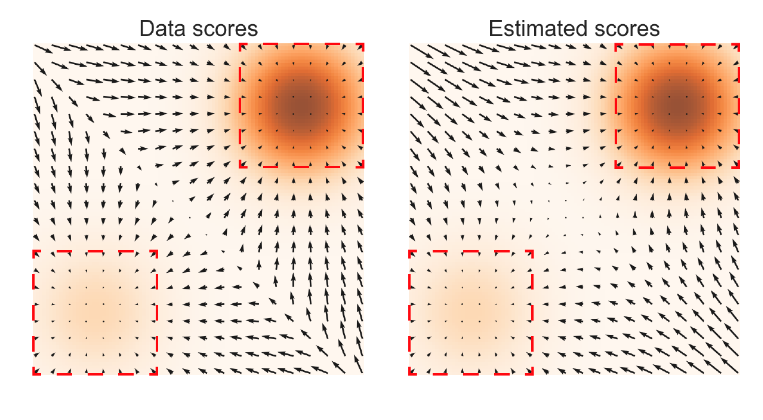
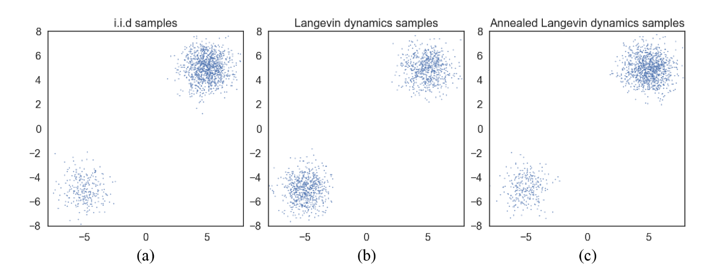
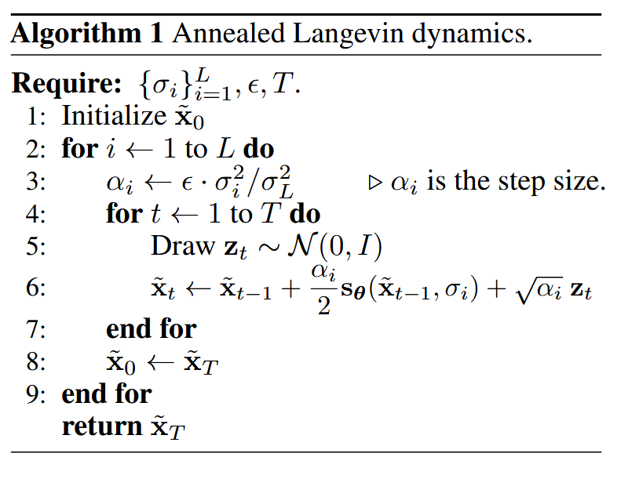

+++

title = 'Score Based Generative Model'
date = '2025-08-17T16:20:48+08:00'
draft = false
outdatedInfoWarning = false
collections = []
tags = ["Deep Learning", "Diffusion Models"]
categories = ["Deep Learning", "Diffusion Models"]
summary = "简要讨论什么是 score baesd model，以及探索 score mathcing 和 DDPM 之间的关系"

+++

## 1. 什么是 score based model

### 1.1 基于 score 的损失函数

简要了解一下分数的函数的定义，对于一个分布 $p(x)$，其分数函数定义如下：
$$
\begin{align*}
s(x)=\nabla_x \log p(x)\tag{1}
\end{align*}
$$
简单而言，就是对数概率密度函数关于 $x$ 的梯度（一阶导），分数函数指明了在概率空间中，概率密度上升最快的方向。如果两个概率密度具有一样的分数函数，那么他们的概率密度在形状上是一致的，这个性质可以通过对两个分数函数同时积分得到，可以发现积分后两者只相差一个常数。
$$
\begin{align*}
\int s_p(x)dx=\int s_q(x)dx+C\tag{2}
\end{align*}
$$
在 AIGC 领域，我们希望得到观测数据的分布 $p(x)$，从而允许我们直接采样实现数据生成。但是这个分布很难学习，我们只能通过变分推断等手段去近似得到，根据变分分布的选择，出现了 VAE 和 DDPM 等方法。前者使用编码器将观测数据映射到一个近似标准高斯分布的隐空间，然后通过编码器实现逆过程，从而实现数据生成。后者则将编码过程固定为加噪过程，通过学习其逆过程（去噪过程），来实现数据生成。所有生成模型的本质都是学习从一个可采样分布到观测数据分布的映射过程。

此时有人根据分数函数的性质提出来新的想法，如果两个分布的分数函数相同，而我们并不关心具体的概率值，只关心分布的形状，因此可以抛弃掉归一化项，那么只要我们让模型拟合观测数据的分布函数，不也相当于拟合了观测数据的分布吗？

假设我们有观测数据 $x\sim p_{data}(x)$，可以建立一个模型 $p_\theta(x)$ 去近似其分数函数，此时损失函数可以设为如下形式：
$$
\mathcal{J}(\theta)=\frac{1}{2}\int p_{data}(\mathbf{x})||\nabla \log p_{data}(\mathbf{x})-\nabla \log p_{\theta}(\mathbf{x})||^2d\mathbf{x}\tag{3}
$$
但是问题在于 $p_{data}(\mathbf{x})$ 未知，所以其对应的分数函数也未知。但是经过一系列变化后，公式（3）可以写成如下等价形式：
$$
\mathcal{J}(\theta)=\mathbb{E}_{p_{data}(\mathbf{x})}\left[tr(\nabla_{\mathbf{x}}s_{\theta}(\mathbf{x}))+\frac{1}{2}||s_{\theta}(\mathbf{x})||^2_2\right]\tag{4}
$$
但是公式（4）中存在分数函数的梯度，这相当于 $p_\theta(\mathbf{x})$ 的二阶导，在计算上是非常困难的，所以有两种替代方法，分别是去噪分数匹配和分层分数匹配。

去噪分数匹配规避了 $tr(\nabla_{\mathbf{x}}s_{\theta}(\mathbf{x}))$ 计算。首先选定一个观测数据进行加噪，得到 $q_{\sigma}(\tilde{\mathbf{x}}|\mathbf{x})$，我们不再直接拟合原始数据的分数，而是拟合加噪后的分数：
$$
\begin{align*}
\mathcal{J}(\theta)=\frac{1}{2}\mathbb{E}_{q_{\sigma}(\tilde{\mathbf{x}}|\mathbf{x})p_{data}(\mathbf{x})}\left[||s_{\theta}(\mathbf{\tilde{x}})-\nabla_{\mathbf{\tilde{x}}}\log q_{\sigma}(\tilde{\mathbf{x}}|\mathbf{x})||_2^2\right]\tag{5}
\end{align*}
$$
当我们添加的噪声足够小时，我们可以近似的认为学到的就是原始数据的分数。

> 通常我们选择标准高斯分布的噪声，由于我们有观测数据，因此加噪后 $\tilde{\mathbf{x}}\sim\mathcal{N}(\tilde{\mathbf{x}};\mathbf{x},\sigma^2\mathbf{I})$。所以公式（9）中分布实际上是已知的。

分层分数匹配使用随机映射来近似$tr(\nabla_{\mathbf{x}}s_{\theta}(\mathbf{x}))$ ，其形式如下：
$$
\begin{align*}
\mathcal{J}(\theta)=\mathbb{E}_{p_{data}(\mathbf{x})}\left[\mathbf{v}^T\nabla_{\mathbf{x}} s_{\theta}(\mathbf{x})\mathbf{v}+\frac{1}{2}||s_{\theta}(\mathbf{x})||^2_2\right]
\end{align*}
$$
其中 $\mathbf{v}$ 是一个随机向量，例如多元标准高斯。但是这种方式会引入大约四倍的计算量。

以上两种方法都可以让我们得到一个拟合了观测数据分数的模型，接下来要解决采样问题。

### 1.2 朗之万动力采样

朗之万动力采样满足我们仅仅利用分数函数从目标分布中采样的需求。其基本过程为：首先给定一个固定的采样步长 $\epsilon>0$ ，然后从一个已知的先验分布中采样一个初始值 $\tilde{\mathbf{x}}_0\sim\pi(\mathbf{x})$，接下来迭代之下如下过程：
$$
\tilde{\mathbf{x}}_t=\tilde{\mathbf{x}}_{t-1}+\frac{\epsilon}{2}\nabla_\mathbf{x}\log p(\tilde{\mathbf{x}}_{t-1})+\sqrt{\epsilon}\mathbf{z}_t\tag{6}
$$
其中 $\nabla_\mathbf{x}\log p(\tilde{\mathbf{x}}_{t-1})$ 通过模型学习得到，而 $\mathbf{z}_t$ 则是一个一个标准高斯噪声。当 $\epsilon\to0,T\to\infin$时，$\mathbf{x}_T$ 就可以看作从 $p(\mathbf{x})$ 采样得到。

### 1.3 一些挑战

上面建立了训练和采样的基本范式，但是仍然存在一些挑战。

首先是流形假设和低概率密度区域会导致分数估计不准确。所谓流形假设是指原始数据实际上集中分布在一个低维流形中，但是我们上述过程要求数据分布在整个空间中。而低概率密度区域意味着其相应样本也比较少，因此通过已有的观测数据可能无法准确的估计出这些低概率区域的分数。

如下图所示，左边为原始数据计算得到的分数，而右侧而是预测的梯度。颜色越深表示概率密度越高，箭头表示梯度。不难看出预测的梯度在低概率区域和原始数据有明显不同，只有红框的部分可以说是近似。

此外朗之万采样也存在一个问题，即当数据集中分布在某些区域，而这些区域之间被低概率密度所隔离。此时朗之万采样很难在合理的时间内正确地恢复这些集中分布的区域。如下图所示，图 A 表示精确采样，图 B 表示朗之万采样，可以发现朗之万的采样对于左下角的采样结果和精确采样有着明显不同。而图 C 是使用改进后的退火朗之万采样得到的结果，可以看到问题得到了一定的改善。

### 1.4 噪声条件分数模型

前面我们提到流形假设和低概率密度区域会导致分数估计不准，这个问题可以通过向原始数据中添加噪声解决。当我们添加噪声后，原始数据的分布会被抹平，而使用例如使用标准高斯噪声，则可以将概率密度扩展到整个空间中。但是问题在于我们要添加多大的噪声呢？如果我们添加的噪声过小，则其效果可能不明显。而如果添加过大的噪声，则会破坏原始数据的信息，进而影响模型的学习。

一个比较好的办法使用同时使用各种尺度的噪声。我们定义噪声序列 $\{\sigma_i\}_{i=1}^L$ 有 $\frac{\sigma_1}{\sigma_2}=\dots=\frac{\sigma_{L-1}}{\sigma_{L}}>1$。加噪后的数据为 $q_{\sigma}(\mathbf{x})=\int p_{data}(\mathbf{t})\mathcal{N}(\mathbf{x}|\mathbf{t},\sigma^2\mathbf{I})dt$，这里 $\mathbf{t}$ 表示原始数据。当 $\sigma_1$ 足够大时，可以解决前面提到的分数估计不准确的问题，当 $\sigma_L$ 足够小时，则可以最小化对原始数据的影响。此时我们的目标是构建一个条件分数模型 $s_{\theta}(\mathbf{x},\sigma)$，学习在所有的噪声条件下的分数 $\nabla \log q_{\sigma}(\mathbf{x})$。

回顾一下，我们不难发现，条件噪声分布模型天然的符合去噪分数匹配的损失函数，两者可谓相辅相成。实际上分层分数匹配同样也可以用于噪声条件分数模型，但是相比而言，去噪分数匹配是最好的选择。

现在我们回到去噪分数匹配，对于观测数据 $\mathbf{x}$，我们定义加噪后的数据 $q_\sigma(\tilde{\mathbf{x}}|\mathbf{x})=\mathcal{N}(\tilde{\mathbf{x}}|\mathbf{x},\sigma^2\mathbf{I})$。此时有分数函数 $\nabla_{\tilde{\mathbf{x}}}\log q_\sigma(\tilde{\mathbf{x}}|\mathbf{x})=-\frac{\tilde{\mathbf{x}}-\mathbf{x}}{\sigma^2}$。那么根据去噪分数匹配公式（5），我们可以写出如下损失函数：
$$
\begin{align*}
\mathcal{l}(\theta;\sigma)=\frac{1}{2}\mathbb{E}_{q_{\sigma}(\tilde{\mathbf{x}}|\mathbf{x})p_{data}(\mathbf{x})}\left[\left|\left|s_{\theta}(\mathbf{\tilde{x}},\sigma)--\frac{\tilde{\mathbf{x}}-\mathbf{x}}{\sigma^2}\right|\right|_2^2\right]\tag{7}
\end{align*}
$$
需要注意，由于我们希望建立在不同噪声下的模型，所以我们将噪声也作为模型的输入之一。

公式（7）建立了针对某一噪声的训练损失，而要综合我们使用的所有噪声的损失，直接求和即可：
$$
\begin{align*}
\mathcal{L}(\theta,\{\sigma\}_{i=1}^L)=\frac{1}{L}\sum_{i=1}^L\lambda(\sigma_i)\mathcal{l}(\theta,\sigma)\tag{8}
\end{align*}
$$
这里采用了加权求和的方式，且权重大小和噪声大小相关。通常为了抵消公式（7）中分母上 $\sigma^2$ 的影响，直接令 $\lambda(\sigma_i)=\sigma_i^2$，从而保证不同噪声下的分数在同一个量级。

### 1.5 退火朗之万采样

确定了可用的损失函数之后，模型的训练就顺理成章了。接下来我们要解决朗之万采样的问题，前面提到当分布比较复杂时，朗之万采样很难在有限的时间内得到准确的采样结果。所以退火朗之万采样就被提了出来，其基本流程如下：

其中 $\alpha_i$ 实际上可以有多种不同的选择，这里的用法是为了固定信噪比，具体的解释可以看原论文。其基本原理时，在最开始使用较大的噪声，从而降低低维流形的影响，让分数函数在低概率区域也可以准确估计，从而使采样过程顺利进行。然后逐步降低噪声，以高噪声为出发点，逐渐逼近低噪声的原始数据分布。这个噪声不断降低的过程就是所谓的退火。

## 2. 改进技巧

虽然上述内容建立了一个完整的 score based model，但是其效果一般，只能在低分辨率上取得比较好的生成结果。因此原作者又发了一篇文章，提出了一些改进的方法。

> 鉴于该论文只是提出了五个改进方法，所以我并没有阅读原文，以下内容来自张振虎的博客。

好的，这是你要求的 Markdown 格式内容，其中 LaTeX 公式保留：

1.  初始噪声等级 $\sigma_1$ 的最佳设定，它的大小影响图像生成的多样性（这其实很符合直觉认知），$\sigma_1$ 越大多样性越好，$\sigma_1$ 的最佳选择是训练数据集里样本对之间的最大的欧式距离。
2.  $\{\sigma_i\}_{i=1}^L$ 设置成公比为 $\gamma$ 的几何级数，即 $\gamma = \sigma_{i-1}/\sigma_i$，此外 $\gamma$ 满足约束
    $\Phi\left(\sqrt{2D}(\gamma-1)+3\gamma\right) - \Phi\left(\sqrt{2D}(\gamma-1)-3\gamma\right) \approx 0.5$，其中 $\Phi$ 是标准高斯分布的累积分布函数，$D$ 是观测变量 $x$ 的维数。
3.  神经网络模型由原来的 $s_\theta(\tilde{x}, \sigma_i)$ 改成 $s_\theta(\tilde{x})/\sigma_i$，把噪声等级 $\sigma_i$ 从模型输入中去掉，$s_\theta(\tilde{x})$ 称为无条件分数网络 (unconditional score network)。
4.  在计算预算允许的范围内选择 $T$，然后选择一个 $\epsilon$，使下列方程最大接近 1，其中 $x_T \sim \mathcal{N}(0, s_T^2 I)$。

    (4.1.68)
    $$
    \frac{s_T^2}{\sigma_i^2} = \left(1 - \frac{\epsilon}{\sigma_L^2}\right)^{2T} \left(\gamma^2 - \frac{2\epsilon}{\sigma_L^2 - \sigma_L^2\left(1 - \frac{\epsilon}{\sigma_L^2}\right)^2}\right) + \frac{2\epsilon}{\sigma_L^2 - \sigma_L^2\left(1 - \frac{\epsilon}{\sigma_L^2}\right)^2}
    $$
5.  训练模型时加入指数滑动平均 (exponential moving average, EMA) 技术，$\theta_{ema} \leftarrow m\theta_{ema} + (1-m)\theta_t$，得到一份 EMA 的模型参数副本，其中 $m = 0.999$ 是动量参数。在推理时 (生成图像) 时，用 EMA 的模型参数 $\theta_{ema}$。注意，在应用 EMA 时，实际是都有两套模型参数的，模型训练过程中仍然按照原来的优化器 (比如 Adam) 去更新参数，只是在每一轮更新结束后，额外更新和保存一份 EMA 版本的参数 $\theta_{ema}$。训练完成后输出保存的是两套模型参数，在推理时可以选择用原始模型参数还是使用 EMA 版本的参数。EMA 版本的参数理论上能缓解原始参数过拟合的情况，但这也不是总成立的。

## 3. score 和 DDPM 之间的联系

我们回顾 DDPM 的训练目标，首先 DDPM 的前向加噪定义为 $q(\mathbf{x}_t|\mathbf{x}_0)=\mathcal{N}(\mathbf{x_t};\sqrt{\bar{\alpha}_t}\mathbf{x}_0,(1-\bar{\alpha}_t)\mathbf{I})$，其解析式可以写成 $\mathbf{x}_t=\sqrt{\bar{\alpha}_t}\mathbf{x}_0+\sqrt{1-\bar{\alpha}_t}\epsilon$，可以得到 $\epsilon=\frac{\mathbf{x}_t-\sqrt{\bar{\alpha}_t}\mathbf{x}_0}{\sqrt{1-\bar{\alpha}_t}}$。

同时，我们写出 $\nabla_{\mathbf{x}_t}\log q(\mathbf{x}_t|\mathbf{x}_0)=-\frac{\mathbf{x}_t-\sqrt{\bar{\alpha}_t}\mathbf{x}_0}{1-\bar{\alpha}_t}$，和上面的噪声项对比，不难发现两者只相差了一个系数的关系。因此 DDPM 的预测目标 $||\epsilon-\epsilon_\theta||$ 实际上就是在预测前向加噪的噪声分布的分数函数，只是经过了一个系数的缩放而已。

所以 DDPM 的预测目标和 Score based model 实际上是等价的，都是在估计一个分数函数。同时他们有都可以解释为一个随机微分过程，这个概念我们之后再做讨论。

## Reference

1. [张振虎的博客-4. 基于分数的生成模型（Score-based generative models）](https://www.zhangzhenhu.com/aigc/Score-Based_Generative_Models.html#score-based-generative-models)
2. [Improved techniques for training score-based generative models](http://arxiv.org/abs/2006.09011)
3. [Generative modeling by estimating gradients of the data distribution](http://arxiv.org/abs/1907.05600)
