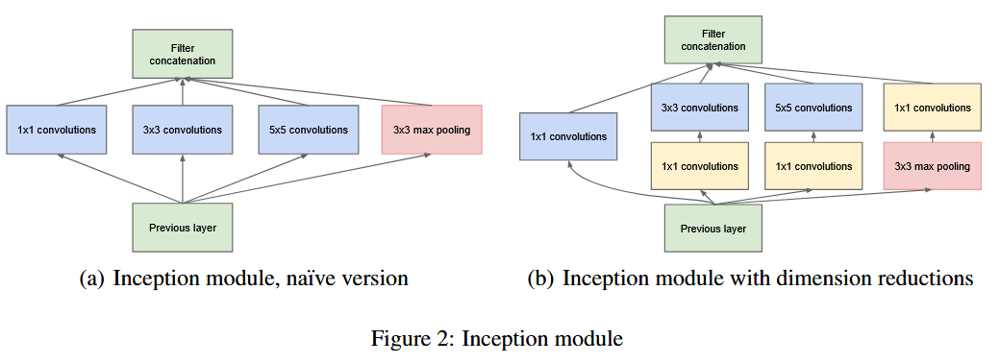

## 论文通读

本文内容来自以下论文的通读总结，由于阅读过程不够细致，可能存在一定的理解偏差。

1. [Going deeper with convolutions](http://arxiv.org/abs/1409.4842)
1. [Bag of Tricks for Image Classification with Convolutional Neural Networks](http://arxiv.org/abs/1812.01187)

## 一、Going deeper with convolutions

### 1. Motivation

目前提高深度学习模型性能最简单的方法就是使用更大的模型、更多的参数量，但是毫无疑问这会导致几个问题。首先是过拟合问题，越大的模型越容易过拟合，尤其是在训练不足的时候。其次是计算资源不足的问题，越大的模型训练所需要的计算资源也越多。

已经有很多相关的研究致力于解决以上问题，例如传统 CNN 模型通过共享卷积核参数的形式，大幅降低了模型的参数量，但是随着模型深度和宽度的增加，其参数量依然不可小视。

此外对于卷积核大小的选择也会影响模型的性能，例如大的卷积核有助于整合更广的空间分布内的信息，小的卷积核则适合提取空间分布较小的信息，组合使用才能获得更好的效果。

本文提出了 Inception 架构，通过三种不同大小的卷积核（1x1、3x3、5x5）组合使用，提取不同尺度的信息。同时在 1x1 卷积中实现降维处理，其原理类似于 NiN（Network in Network）。

### 2. Methods

论文提出了 Inception 结构，通过该结构的堆叠构建完整的网络。

上图就是论文所提出的两种结构，其中 (a) 是基础结构，在此基础上添加了 1x1 reduction 模块后形成了右侧 (b) 的结构，在实际的模型构建中使用 (b) 结构，我们接下来的讨论也仅限于 (b) 结构。

按通路顺序。最左侧的只有一个 1x1 conv，该模块主要是对上一次的通道数进行降维处理，相当于对每个像素点做了一个全连接。中间是两个类似的通过，在经过 1x1 conv 之后分别接了一个 3x3 conv 和 5x5 conv，其中 1x1 conv 的目的和左侧通路相同，是进行通道降维，之后的 3x3 和 5x5 卷积则是使用不同大小的卷积核来提取不同尺度的信息。最右侧的通路则是首先经过一个 3x3 max pooling，池化过程通道数不变，然后做了一个 1x1 conv 进行通道降维。

需要注意的是整个 Inception 中所有的操作，无论是卷积还是池化，都是 same 的，即处理前后数据的 width 和 height 不变。对于 width 和 height 的降维则是由不同 Inception 模块之间的卷积或者池化进行，由用户自行设计。

论文使用这种 Inception 模块构建了一个 GoogLeNet 网络，结构如下：

可以看到该网络在中间引出了两个额外的输出 SoftMax，这是为了解决网络过深导致的训练困难问题，三个 SoftMax 的损失按照一定权重加和后进行反向传播，本文使用的权重是 `Loss = Loss(softmax3) + 0.3 * Loss(softmax2) + 0.3 * Loss(softmax1)`。即中间层的损失乘以 0.3 之后和主要输出损失相加，然后做 backforward，在推理阶段则只使用 softmax3 的输出。

### 3. Conclusion

Inception 通过 1x1 卷积实现通道降维，从而降低参数量。使用 3x3 和 5x5 卷积的组合来捕捉不同尺度的信息。使用中间层输出辅助训练，推理只使用最终输出。

## 二、Bag of Tricks for Image Classification with Convolutional Neural Networks

本文主要介绍了使用 CNN 进行图片分类是的一些小技巧。

### 1. 大批量训练

在很多研究中发现，随着 batch size 的增大，模型在验证集的性能往往会下降。为了解决这个问题，让模型可以使用大批量训练而不会对性能产生太大影响，可以采用如下方法。

1. 线性缩放学习率：随着 batch size 增大，实际上不会改变随机梯度的期望，而是减小了方差。或者说减小了梯度中的噪音，因此可以采用更大的学习率。假设初始 batch size 是 256，初始学习率是 0.1，那么可以对于新的 batch size `b` 可以使用公式 `0.1 x (b/256)` 来缩放初始学习率。

2. warm up，即在一开始使用比较小的学习率，例如选择使用 m 个 batch 进行 warm up。那么在这 m 个 batch 中可以让学习率从0 线性增长到我们设定的初始学习率。
3. zero $\gamma$，这个主要用于 Residual，即一个残差块表示为 `block`，其输入是 `x`，那么这个残差块的输出可以表示为 `x+block(x)`。通常 `block(x)` 在输出前会使用一个 BN 层进行标准化，然后通过 $\gamma x +\beta$ 进行缩放偏移，通常使用 $\gamma=0,\beta=1$ 作为初始值。如果我们也将 $\gamma$ 初始化为零，那么残差块的初始输出就是 `x` 本身，这相当于残差块从一个很简单的恒等变换开始训练，并随着训练过程逐渐变得复杂，这有助于解决梯度爆炸和梯度消失。
4. No bias decay，主要针对 L2 正则化。即只对权重参数进行正则化，而不对偏置或者BN层的参数进行正则化。

### 2. 低精度训练

使用 FP16 存储参数和激活值，保留一份 FP32 副本用于参数更新。对于损失进行缩放以匹配 FP16。这种方法已经由 Pytorch 实现，详细信息可以查看文档。

### 3. 其他方法

例如使用余弦学习率衰减，标签平滑，知识蒸馏，混合训练。

其中余弦学习率衰减是按照余弦函数的趋势调整学习率的变化。

标签平滑是将分类问题的 Target 进行平滑化，默认情况下我们让正确的标签概率为 1，其他错误的为 0。但是平滑化允许错误的标签具有小的概率，这有助于解决模型的过拟合问题。

知识蒸馏就是使用一个大模型作为教师模型，然后使用训练好的教师模型的输出来训练一个比较小的学生模型，从而让小的学生模型在教师模型处理过的更好的数据上的到接近性能。

混合训练是提出了一种新的数据增强方法，即将两种图片按照随机权重进行相加，它们对应的标签也按比例相加。

## Reference

1. [Going deeper with convolutions](http://arxiv.org/abs/1409.4842)
2. [awesome-DeepLearning/GooLeNet](https://github.com/PaddlePaddle/awesome-DeepLearning/blob/master/docs/tutorials/computer_vision/classification/GoogLeNet.md)
3. [Bag of Tricks for Image Classification with Convolutional Neural Networks](http://arxiv.org/abs/1812.01187)

