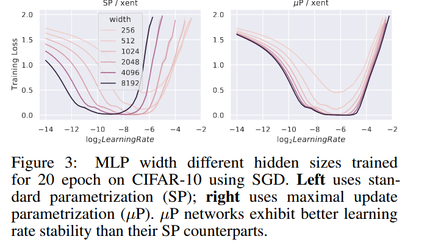
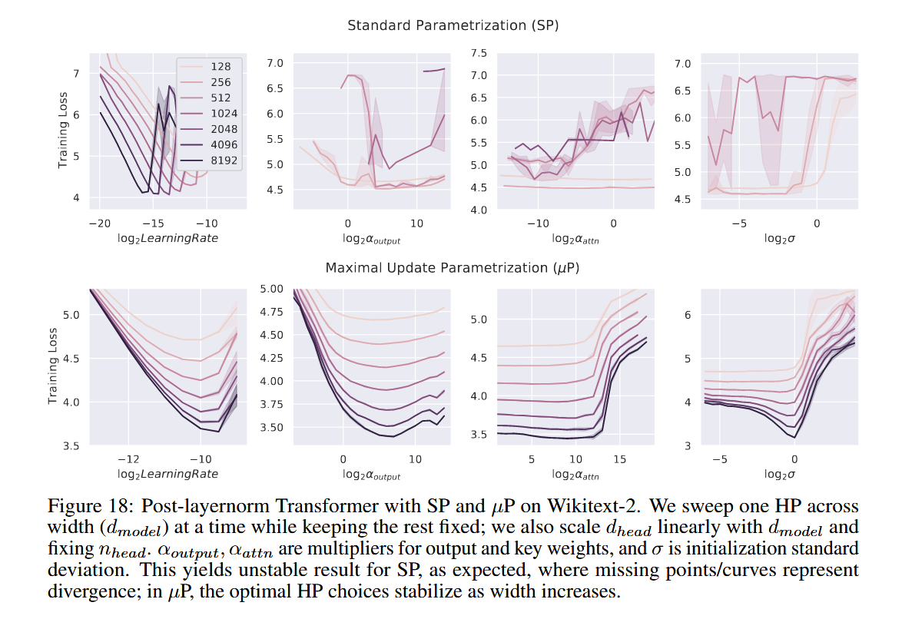
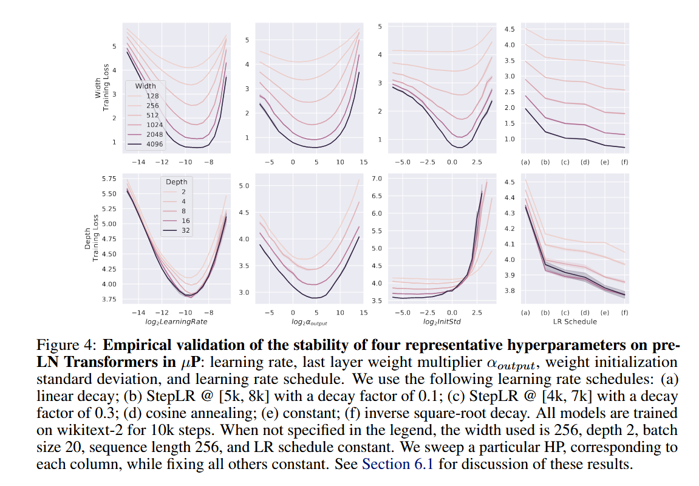
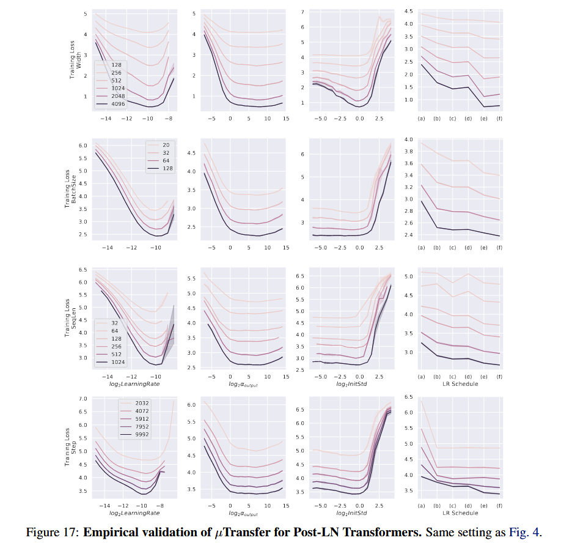
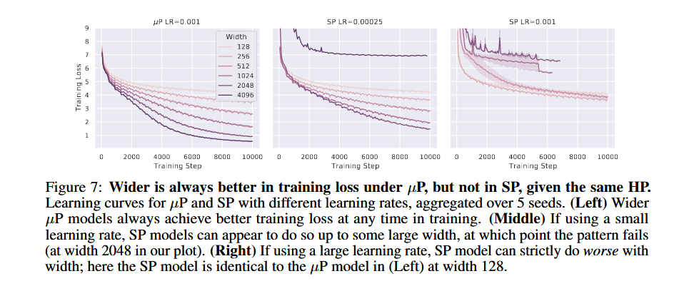

本文内容来自 [Tensor Programs V: Tuning Large Neural Networks via Zero-Shot Hyperparameter Transfer](http://arxiv.org/abs/2203.03466)。

**需要注意的是，本研究的目的是让某些最佳超参数在不同的大小的模型之间进行迁移，而不是找到最佳的模型大小或者最佳的超参数组合。**

## 0、Abstract

深度学习中的超参数（HP）调优成本高昂，对于拥有数十亿参数的神经网络（NN）来说更是难以承受。我们发现，在新近提出的最大更新参数化（Maximal Update Parametrization, μP）框架下，许多最优超参数在模型规模变化时依然保持稳定。基于这一发现，我们提出了一种新的超参数调优范式，称为μ迁移（μTransfer）：将目标模型以μP方式参数化，先在小模型上间接调优超参数，然后将这些超参数零样本迁移（zero-shot transfer）到全尺寸模型，即完全无需直接调优大模型。我们在Transformer和ResNet上验证了μ迁移的有效性。例如：1）通过将预训练超参数从一个1300万参数的模型迁移，我们超过了BERT-large（3.5亿参数）的公开指标，总调优代价与预训练BERT-large一次相当；2）通过从4000万参数的模型迁移，我们实现了对6.7B GPT-3模型公开指标的超越，调优开销仅为总预训练成本的7%。我们的Pytorch实现可在 [github.com/microsoft/mup](https://github.com/microsoft/mup) 找到，可通过pip install mup安装。

## 1、Introduction

超参数调优一直是深度学习领域一项重要的技术，也是构建深度学习模型不可或缺的一步。好的超参数配置能够降低训练消耗的资源、提高模型的拟合能力。但是随着深度学习的发展，模型变得愈发庞大，对于这种参数量非常大的模型进行调优时不得不考虑其所需的成本。一种普遍用于降低调优成本的方法是，首先在相同结构，但是参数量较小的模型上进行调优，然后将这个结果直接应用在最终所使用的大模型上。

> 这里涉及一个概念，即 zero-shot HP transfer，零样本超参数迁移。意思是将一个在小模型验证过的超参数，在不需要任何额外调整的情况下直接应用到另一个大模型上。

但是已有研究发现，当模型参数趋于无限大时，模型将无法进行特征学习[[1]](#1)。例如对于标准参数化（Standard Parameterization）来说，其初始化时将模型的参数设定为相同的单位大小，但是实际上在训练过程中，由于不同网络层的学习率或者说参数更新的尺度不平衡，很容易导致某些参数出现爆炸性的缩放，从而导致模型无法正确的进行特征学习，这种现象在大模型中非常容易出现。因此在小模型中得到的调优方法在大模型中可能根本不适用。

图1 是一个基于 Transformer 的例子，通过改变 Learning Rate 的大小，观察其对于不同的模型宽度（每层神经元数量）的学习效果的影响（以训练损失表示）。


左图使用标准参数化 SP，右图使用本文的方法。可以看出，在标准参数化下，不同规模的模型，其最佳 Learning Rate 不同，也就是发生了 optimum shifts。但是应用了本文的方法之后不同的规模的模型的最佳参数基本一致，且随着模型的规模增大，其性能也变得更好。

不仅仅是对于宽度有用，实验表明，在一定的约束下，对于 Depth、Batch Size、Input Length、和 Training Time，该方法同样有效。

这个方法被称之为 $\mu Transfer$，基于 Maximal Update Parametrization (<span>$\mu P$</span>) [[1]](#1)。该方法的基本描述如下：

```
1. 对目标模型进行最大更新参数化（Maximal Update Parametrization）
2. 对一个小版本的目标模型进行调优
3. 将最优参数直接应用到目标模型
```

该方法有如下几个优点：

1. **Better Performance**：同样的较大规模的模型，在该方法下得到的性能往往优于标准参数化。
2. **Speed Up**：直接通过小模型调优极大的加速了调优过程。
3. **Tune Once For Whole Family**：对于某一系列的模型（只有规模区别），只需要在其中的小模型上进行一次调优，即可应用于这个系列的所有模型。
4. **Better Compute Utilization**：在小模型上调优可以更好的利用资源。
5. **Painless Transition from Exploration to Scaling Up**：更轻松地从探索模型转向扩展模型。

除了超参数的稳定性之外，本文还发现对于 $\mu P$ 而言，更大的参数就代表了更好的性能。这种结论在标准参数化中往往不一定成立。

> 需要注意的是，本文的研究专注于训练损失，而不考虑测试损失。但是在如果模型本身具有良好的泛化能力，那么本文的方法同样有效，因为测试损失往往和训练损失高度相关。但是在某些场景下，例如小样本调优，此时测试损失会受到更多其他因素的影响。相关问题在 Section 6 中讨论。

虽然 $\mu Transfer$ 可以实现超参数迁移，但是并不是所有的超参数都适用。

|                   <span>$\mu$ </span>Transferable                   |           <span> Not $ \mu$ </span>Transferable            |                   <span>$\mu$ </span>Transferred Across                    |
| :----------------------------------------------------: | :-----------------------------------------: | :----------------------------------------------------------: |
| optimization related, init, parameter multipliers, etc | regularization (dropout, weight decay, etc) | width, depth\*, batch size\*, trainning time\*, seq length\* |

最左列表示可以直接通过 <span>$\mu P$ </span> 规则进行迁移，中间表示不可迁移，最右列迁移是根据这些参数进行的。

其中可直接迁移部分的更详细描述为：

1. optimization related：与优化过程相关的，例如学习率，动量，Adam beta，LR schedule。
2. init：与初始化相关的，例如各种参数初始化方法和相关配置。
3. parameter multiplier：对于模型参数的缩放，例如残差连接中的缩放系数，BN和LN系数，以及其他自定义的缩放结构。

而最右列所谓的 <span>$\mu$ </span>Transferred Across，是指可迁移的超参数，是在根据一类超参数决定如何迁移的，因为这一类超参数决定了模型的规模。

> \* 表示该参数只在 transformer 上进行了测试，其他则都有理论验证。


本文的贡献：

1. 证明了通过 <span>$\mu P$</span> 进行超参数零样本迁移的可能性。
2. 证明了该方法对于 Adam 同样适用。
3. 提出了 <span>$\mu Transfer$</span>，适用于 SGD 和 Adam。
4. 验证了该方法对于机器翻译、LLM的效果和图像识别一样好。
5. 发布了相关 PyTorch 包。

> 后文可能引起混淆的一些术语：目标模型（Target Model）表示要调优的大模型（Large Model），代理模型（Proxy Model）表示实际代理了调优过程的小模型（Small Model），简化 Transformer 的参数 <span>$d_{model},d_{head}=d_k,d_v,n_{head},d_{ffn}$</span>


## 2、Parametrization Matters: A Primer

本章将简单解释一下为什么正确的参数化可以允许超参数在不同宽度的模型中迁移，详细的数学解释在 Appendix J.1to J.3 中。

根据中心极限定理（CLT，Central Limit Theorem），如果我们有 <span>$x_1,\dots,x_n$</span> 是独立同分布的从一个均值为零、方差为一的分布中采样得到。那么对于 <span>$(x_1+\dots+x_n)$</span>，其均值为零 ，方差为 <span>$n$</span>。这个结果由以下公式得到：

<div>

$$
if\quad x_{1},x_{2},\dots,x_{n}\quad are \; \text{iid}\; sampled\; from\; \mathcal N(\mu,\sigma^{2})\\\\
S_{n}=(x_{1}+\dots+x_{n})\\\\
E(S_{n})=E(\sum{x_{i}})=\sum{E(x_i)=n}\mu\\\\
Var(S_{n})=Var(\sum{x_{i}})=\sum(Var(x_{i}))=n\sigma^{2}
$$

</div>


如果我们对<span> $S_{n}$</span> 进行缩放，例如对于 <span>$\frac{1}{n}S_{n}$</span> 而言，其均值 <span>$E(\frac{1}{n}S_{n})=\frac{1}{n}S_{n}=\frac{\mu}{n}$</span>，而方差 <span>$Var(\frac{1}{n}S_{n})=\frac{1}{n^{2}}Var(S_{n})=\frac{\sigma^{2}}{n}$</span>。

> 注意均值和方差的计算过程

很显然，如果我们不进行缩放，当 <span>$n\to \infty$ </span> 时，那么 <span>$S_n$ </span> 的分布将会发散。或者进行 <span>$\frac{1}{n}$ </span> 缩放，那么 <span>$S_n$ </span> 的方差也会趋向于零，一个均值为零，方差为零的分布是完全没有意义的。

当然实际上存在一个缩放，可以保证<span> $S_n$</span> 的分布仍然是标准高斯分布，这个缩放因子就是<span> $\frac{1}{\sqrt(n)}$</span>。

现在我们定义这样一个公式
<div>

$$
F_n(c) \overset{def}{=} \mathbb E_{x_1,\ldots,x_n} f\big(c(x_1 + \cdots + x_n)\big)
$$

</div>
其中 <span>$f$</span> 表示一个有界连续函数。我们定义 <span>$c=\frac{\alpha}{\sqrt{n}}$ </span>。根据中心极限定理，<span>$G_n(\alpha)=F_n(c)\to \mathbb E f(\mathcal{N}(0, \alpha^2))$ </span> 在 <span> $n\to \infty$ </span> 是一个关于 <span> $\alpha$ </span> 的函数。假设我们要最小化 <span> $G_n(\alpha)$ </span>，那么我们会得到 <span> $ \alpha_n^* \overset{def}=\arg\min_\alpha G_n(\alpha)$ </span>，其中 <span> $\alpha_n^{*}$ </span> 就是令 <span> $G_n(\alpha)$ </span> 最小化的最优参数。当 n 足够大时，对于任意 <span> $N>n$ </span>，甚至 <span> $N\to \infty$ </span>，<span>$a_N^*$ </span> 应当非常接近 <span>$a_n^*$ </span>。这就意味着，对于一个较小规模的问题，它的缩放参数 <span> $\alpha_n^*$ </span> 和一个较大规模的问题的缩放参数<span> $\alpha_N^*$ </span> 是近似的。此时我们就可以直接将 <span> $\alpha$ </span> 这个超参数从小模型直接应用到大模型。我们将这样的一个 <span> $c=\frac{\alpha}{\sqrt n}$ </span> 叫做正确的参数化（即我们采用一种方式参数化了 <span> $c$ </span>，从而描述了 <span> $c$ </span> 应该如何随着问题规模 <span> $n$</span> 变化）。

> 这里我们可以将<span> $x_1,\dots,x_n$ </span> 视为神经网络中的一层神经元。对于小规模网络 n，如果我们为了降低训练损失而对某一层的神经元进行了某种缩放，例如添加了BN 层，此时 <span> $c$ </span> 就是一个超参数，而我们可以通过调节 $c$ 来改变模型的性能。现在我们希望在一个小模型上找到一个最优的缩放因子，使得损失函数最小，然后将其应用到一个更大的模型上，那么通过将这个缩放因子 $c$ 设置为<span> $c=\frac{\alpha}{\sqrt{n}}$ </span> 的形式，从而使 $c$ 对于规模 n 的变化不敏感。从而实现这个最优 $c$ 可以从小模型直接迁移到大模型的效果。
>
> 为什么分母是 <span> $\sqrt n$？</span>这里因为我们假定是标准高斯分布，通过前面的推导可以发现，分母设置为 $\sqrt n$ 时，缩放之后的分布只和分子相关，而不和问题规模 n 相关。
>
> 如果你实在感到困惑，请先放一放，继续看下去。

需要强调的是，如果要让任意超参数都是可迁移的（Transferable），那么就不能只对某个超参数进行参数化，而是要对所有 $\mu$Transferable 类别下超参数进行参数化。更具体地解释将在 Section 5 给出。

## 3、Hyperparameters Don’t Transfer Conventionally

目前社区中的研究表现出一些存在矛盾的观点。一方面，人们普遍认为不同的模型，无论是大小还是结构，其最有超参数就是不同的。例如很多研究中对于不同大小和不同结构的模型进行单独的调优。但是在另一方面，涉及不同模型之间的对比时，人们往往固定一个组超参数，认为这样的对比才是公平的。这隐含的认为不同的模型之间最优超参数是可以相同的。但**超参数实际上会随着模型变宽变大，不断变化**，本章证明了这个结论。

> 这一章其实就是在不同的模型上进行标准参数化（SP）和 $\mu Transfer$ 的区别，我在这里就直接展示并描述结果。



Figure.3 展示了对 MLP 进行对比的结果，实际上表达了和上文 Figure.1 一样的结论。论文中还以 Figure.1 说明了该方法对于简单的 MLP 和复杂的 Transformer 一样的有效。



Figure.18 展示了在 Transformer 中对不同超参数应用 $\mu Transfer$ 的结果。说明该方法适用于不同的超参数。

## 4、Unlocking Zero-Shot Hyperparameter Transfer with μP

以一个具有两层隐藏层的 MLP 为例，我们定义其数学描述并使用 LeCun 进行初始化：
<div>

$$
f(\xi)=W^{3T}\phi(W^{2T}\phi(W^{1T}\xi +b^1)+b^2)\\\\
with\; init.\quad W^1\sim\mathcal N\left(0,\frac{1}{d_{in}}\right),W^{2,3}\sim \mathcal N \left(0,\frac{1}{n}\right),b^{1,2}=0,
$$

</div>
其中激活函数 $\phi=ReLU$ 。

如果我们希望实现 $\mu Transfer$，我们只需要修改初始化部分，基本形式如下：
<div>

$$
\text{initialize}\quad W^1\sim \mathcal N\left(0,\frac{1}{d_{in}}\right),W^2\sim\mathcal N\left(0,\frac{1}{n}\right),W^3\sim N\left(0,\frac{1}{n^2}\right),b^{1,2}=0\\\\
\text{with SGD learning rates}\quad \eta_{W^1}=\eta_{b^1}=\eta_{b^2}=\eta n,\eta_{W^2}=\eta,\eta_{W^3}=\eta n^{-1}
$$

</div>
这里 $\eta$ 表示了一个全局主学习率，模型各部分的学习率与主学习率相关。这里的定义展现了参数化与模型规模 $n$ 的缩放关系。

在实际使用中，我们通常会加入一个常数因子，来保证上述参数化方法在某些设置下可以同标准参数化方法保持一致。例如引入 <span>$\tilde n \overset{def}=\frac{n}{n_0}$ </span>，其中 <span> $n_0$ </span>表示模型的基本宽度。此时
<div>

$$
\text{Initialize:} 
\quad W_1 \sim \mathcal{N} \left( 0, \frac{1}{d_{\text{in}}} \right), 
\quad W_2 \sim \mathcal{N} \left( 0, \frac{1}{n} \right),
\quad W_3 \sim \mathcal{N} \left( 0, \frac{1}{n \cdot \tilde{n}} \right), 
\quad b_1 = 0, \quad b_2 = 0 \\\\
\\\\
\text{Learning Rates:} 
\quad \eta_{W_1} = \eta_{b_1} = \eta_{b_2} = \eta \tilde{n}, 
\quad \eta_{W_2} = \eta, 
\quad \eta_{W_3} = \eta \tilde{n}^{-1}
$$

</div>
在这种定义下，当<span> $n=n_0$ </span>时，$\mu Transfer$ 将和标准参数化保持一致，方便进行对比测试。并且在<span> $n_0$</span> 上找到的最优超参数，都可以通过上述定义的缩放方法，直接迁移到大模型上使用。

Table.3 给出了通用神经网络下 $\mu P$ 和 SP 的初始化区别。

|  Table.3  | Input weights & all bias |                 Output weights                 |        Hidden weights        |
| :-------: | :----------------------: | :--------------------------------------------: | :--------------------------: |
| Init. Var |   1 / fan_in   | 1 / fan\_in<sup>2</sup>  *(1 / fan\_in)* |    1 / fan\_in    |
|  SGD LR   |   fan_out  *(1)*   |          1 / fan\_in  *(1)*          |             1              |
|  Adam LR  |           1            |         1 / fan\_in  *(1)*         | 1 / fan\_in  *(1)* |

其中 fan_in 表示当前神经元的输入连接数，即上一层的神经元数量。fan_out 表示当前神经元的输出连接数，即下一层神经元的数量。每一个单元格中，左侧表示 $\mu P$ 的配置，右侧使用括号包括的斜体部分表示对应的 SP 配置（如果只有一个就表示两者一致）。对于 bias 而言其 <span> fan_in </span> 总是 1。

通常在使用中我们也会引入常数因子来参数化 fan_in & fan_out。

Transformer 的配置需要做一点修改：使用 $\frac{1}{d}$ attention 而不是 $\frac{1}{\sqrt d}$。Attention logit 通过 $q^Tk/d$ 计算而不是 <span>$q^Tk / \sqrt d$</span>。

Table 3 没有包含 parameter multipliers，如果需要则可以查看 Table 9。同时 Table 8 给出了更加容易实现的版本，也适用于权重共享的网络。

Table 3 适用于 Adam、SGD 或者 Adagrad，更多优化器的配置在 Appendix B.3 给出，更多关于该表的信息也可以在 Appendix B. 找到，其推导则在 Appendix J.

|  Table.8   | Input weights & all bias |        Output weights        |        Hidden weights        |
| :--------: | :----------------------: | :--------------------------: | :--------------------------: |
| Init. Var  |   1 / fan\_in   | 1  *(1 / fan\_in)* |     1 / fran\_in     |
| Multiplier |           1            | 1 / fan\_in  *(1)* |             1              |
|   SGD LR   |  fan_out *(1)*  |      fan_in  *(1)*      |             1              |
|  Adam LR   |           1            |             1              | 1 / fan\_in  *(1)* |

|  Table.9   |        Input weights & all bias         |         Output weights         |        Hidden weights         |
| :--------: | :-------------------------------------: | :----------------------------: | :---------------------------: |
| Init. Var  |      1 / fan\_out *(1 / fan\_in)*       |       1  *(1 / fan\_in)*       |          1 / fan\_in          |
| Multiplier | <span>$\sqrt{fan\\_out}$</span>   *(1)* | 1 / ${\sqrt{fan\\_in}}$  *(1)* |               1               |
|   SGD LR   |             fan_out  *(1)*              |         fan_in  *(1)*          |               1               |
|  Adam LR   |      1 / $\sqrt{fan\\_out}$  *(1)*      |  1 / $\sqrt{fan\\_in}$  *(1)*  | 1 / $\sqrt{fan\\_in}$   *(1)* |


## 5、The Defects of SP and How μP Fixes Them

以一个只有一层隐藏层的线性感知机为例，定义为：
<div>

$$
f(x)=V^TUx\quad V,U\in\mathbb R^{n\times1}\\\\
\text{SP init. }	V_{\alpha}\sim\mathcal N(0,\frac{1}{n}),U_{\alpha}\sim\mathcal N(0,1) \text{ for each }\alpha \in [n]
$$

</div>
这保证了在初始化时<span> $f(x)=\Theta(\mid X\mid)$ </span>，即输出和输入同阶。

我们设置学习率为 1，执行了一步 SGD 之后，新的参数更新为<span> $V'\gets V+\theta U,U'\gets U+\theta V$</span>。

> 你可能对这里的参数更新感到疑惑，实际上对于 V 的更新需要对 V 进行求导，那么 V 自然而然就被消去，从而保留 U。对于 U 而言同理。

一步更新之后我们得到
<div>

$$
f(x) = V'^\top U' x = (V^\top U + θU^\top U + θV^\top V + θ^2 U^\top V) x
$$

</div>
此时注意 $U^TU$ 这一项，由于<span> $U_{\alpha}\sim \mathcal N(0,1)$</span>，根据大数定理，当<span> $n\to\infty$</span> 时，<span>$U^TU=\Theta(n)$</span>，表示这一项是输入 $x$ 的 n 倍高阶，同理加上其他项之后，此时模型的输出将会随着规模的增大发生爆炸。

再考虑使用 $\mu P$ 初始化，即 <span>$V_{\alpha}\sim \mathcal N(0,1/n^2), U\sim\mathcal N(0,1)$</span>，设置学习率<span> $\eta_V=1/n,\eta_U=n$</span>。此时参数更新为
<div>

$$
\begin{aligned}
V' &= V + \eta_V \theta U \\\\
U' &= U + \eta_U \theta V
\end{aligned}
$$

</div>
则经过一步 SGD 之后
<div>

$$
f(x) = \Big( V^\top U + \theta n^{-1} U^\top U + \theta n V^\top V + \theta^2 U^\top V \Big)x
$$

</div>
此时我们就可以发现<span> $f(x)=\Theta(1)$</span> 仍然成立。

这个方法在 Transformer 以及 Adam 中得到了验证


可以发现第一行结果采用 SP 参数化在几步训练之后方差迅速上升，而使用 $\mu P$ 参数化的第二行结果则保持稳定。

也有一些人认为通过合适的缩放学习率可以解决 SP 中的问题，但是 Figure.5 中最右列的 word embedding 层在 SP 中也表现出了与规模 width 无关的更新过程，因此如果简单的缩放学习率，例如将学习率设置的非常小，那么 word embedding 就会完全无法进行学习，同样的情况也会出现在 ResNet 中。因此 $\mu P$ 就是被专门设计适用于所有的隐藏层类型的。

使用 $\mu Transfer$ 调优模型通常会优于使用全局学习率调优的 SP 模型，而且对于任何固定的超参数组合，训练性能不会随宽度增加而下降。


## 6、Which Hyperparameters Can Be μTransferred?

哪些超参数可以使用 $\mu Transfer$？一般而言可以分为三类，就是 Table.1 总结的情况：

1. 可以直接进行迁移的，例如学习率（查看 Table.2）。
2. 用于正则化的超参数迁移效果不好。
3. 定义模型规模的，例如 width、depth或者 batch size 等，是进行迁移的依据。或者说我们就是在这些超参数的不同取值上执行其他超参数的迁移。

第一类超参数（可直接迁移的）在 width 上的迁移已经在 Section 2 中讨论过了。在其他第三类超参数上的迁移可以查看 Appendix E.2。

第二类超参数由于其效果不仅仅取决于模型规模，同时也取决于数据集大小，而本方法只关注模型规模，因此这类参数不应该被认为可以进行迁移。

更多关于超参数的讨论可以查看 Appendix E.1。

本章节还展示了几个超参数迁移的实验。



Figure.4 展示了学习率（LearningRate）、输出层缩放因子（$\alpha_{output}$）、初始化方差（initStd）和 LR Schedule 的迁移效果，不难看出在 depth 和 width 上的这些超参数都很稳定。


Figure.19 展示了在 batch size、seq len 和训练时长上的效果。文章认为虽然最佳点有一些偏移，但是整体还是非常稳定的。

实验还发现，对于使用 Transformers 的语言模型而言，某些最小配置例如最小宽度（256）、最小深度（4），最小 batch size（32）、最小 seq len（128）和最小训练步长（5000），并且对应的大模型在合理的规模内，小模型调优的超参数可以较好的迁移到大模型上。

还有一些需要注意的，某些超参数的最优选择在迁移时可能会出现小偏移，这种偏移也许会对损失产生一些影响。

此外最优的初始化方差在 depth 上的迁移效果不如 width。

还有在 depth 上的迁移只在 pre-layernorm 上生效，但是对于 witdh、batch size、seq len 和 training time 而言在 post-layernorm 上同样生效，结果请看 Figure.17。

还有一个发现是在 depth 上迁移时，调优其他超参数时固定初始化方差会有比较好的迁移效果，相关信息在 Section 7.3。



> 下面是 Appendix E 的一些内容

对于可迁移的超参数而言，其在 width 上的迁移已经在 Section 2 中进行了理论证明，但是在其他维度例如 depth 等上的迁移还只是实验结果。这一部分已经包含了大多数重要的超参数（如果正则化对你而言不是很重要的话），其中 weights multipliers 虽然使用较少，但是通过这个参数可以让同样规模的 $\mu P$ 和 SP 模型具有相同的训练动态效果。

对于不可迁移的参数而言，其中大部分都是正则化相关的内容，因为 $\mu P$ 方法只关注模型规模，而不关注数据集大小，因此其对于正则化相关的参数可能并不适用。此外，对于某个参数是否属于正则化参数并没有一个明确的界限，例如 dropout 和 weight decay 是正则化参数，但是 batch size 也有正则化效果，但是后者往往对其他部分的影响更大，而不是被用于正则化。因此我们认为，对于主要起正则化效果的超参数，本方法无法使用；但是其他具有一定的正则化效果，但是本身不是以正则化为目的的超参数，本方法可以生效。

对于定义了迁移（模型规模）的超参数，我们可以将其分为两类，一类是定义了在一次前向传播/方向传播中所需要执行的操作的个数的超参数，例如 width、depth，seq len等。另一类是定义了需要进行多少次传播的超参数，例如 batch size 和 training steps。

**需要注意的是，本研究的目的是让最佳超参数在这些代表模型规模的参数之间进行迁移，而不是找到最佳的模型规模。**

> 但是通过本方法，可以在小模型上对可迁移的超参数调优后，再搜索最佳最佳模型大小

我们提到 Section 2 我们推导了在 width 上进行迁移的理论证明，实际上 width 定义相当广泛。

例如我们在推导时假定所有层的宽度按照同一个因子进行缩放，但实际上每一层进行单独的缩放也是可以的。

在 attention-based 的模型中，$d_{head},n_{head}$ 都可以任意调整，例如固定某一个，或者同时调整两个。

key、value 的维度也可以单独调整，只要采用了 $\frac{1}{\sqrt d}$ 缩放。

## 7、Efficiency and Performance of μTransfer

本章列举了很多实验，主要是想说明，使用 $\mu Transfer$ 调优可以节省很多时间，并且和传统调优方法具有同样的性能，这里就不进行展示了。

## 8、Wider is Better in μP Throughout Training

当超参数固定时，$\mu P$ 模型的性能总是随着模型规模的增大而变得好，但是 SP 模型则不一定，如 Figure.7 所示



Figure.8 也给出了同样的结果。


## 9、Useful Hyperparameter Transfer: A Theoretical Puzzle

这一章是一个简单的讨论，即我们的目的是在一个大小为 N 的模型上进行调优，使得这个调优后的超参数也可以用在大模型上（$\gg N$）且效果同样好。但是这里有一个问题，那就 N 到底多大？我们并不希望小模型的性能接近大模型，这样我们还有要大模型做什么？因此 N 应该满足 1）足够大使得超参数可以收敛到最好；2）不能很大以至于模型的性能也收敛到最好。实验证明这样的 N 是存在的，但是到底怎么确定呢？好像不知道呢。。。:(

## 10、Related Works

这一章节概述了本文相关的其他研究。

在超参数调优领域，最常使用的是网格搜索或者随机搜索。Snoek 曾经将超参数调优问题视为一个优化过程，将不同超参数的组合的表现视为一个高斯过程，然后通过贝叶斯优化来求解[[2]](#2)。后来又使用神经网络代替高斯过程[[3]](#3)。还有人试图通过大规模并行计算来解决。除此之外还有一些被整合在目前的深度学习框架中的技术，例如 Optuan 和 Talos。

本文的方法和他们不同，不是为了解决超参数调优问题，而是将超参数调优和训练模型的消耗进行解耦。使用本方法时，无论目标模型多大，我们都可以找到一个固定大小的代理模型来找到最佳的超参数。本方法实际上和以上超参数调优方法是兼容的，因为这些方法可以在小模型调优时使用。本文使用的也是网格搜索和随机搜索。

关于超参数迁移的方法也有很多，但是本文是唯一可以实现 zero-shot 即不需要任何额外训练就可以直接完成迁移的方法。此外本方法仅在模型规模上进行超参数迁移，不考虑在不同的任何或者数据集之间实现超参数迁移。但是相关的方法同样可以和本方法结合使用。

>  文章还介绍了一下之前提出的学习率缩放方法，但没什么有用的信息

在输入层参数化上，通常对视觉模型的输入层使用 $fan_{in}$，而语言模型的输入层使用 $fan_{out}$ 初始化。

说明了本文相对于 NTK 参数化（NTP）的优点，即不会导致 NTK 极限。

再一次强调了本文的工作，是提出了一种宽神经网络的正确参数化方式，这里的“参数化”指的是随宽度调整超参数（如初始化和学习率）的方法规则（即“当宽度加倍时，应该怎样调整初始化和学习率？”），而不是针对某一具体宽度下如何设定超参数的具体细则（即“在宽度为1024时，初始化和学习率该如何设置？”）。

## 11、Conclusion

提出并验证了这样一个假设：如果按照最大更新参数化（μP）进行参数化，不同宽度神经网络的超参数（HP）表现的分布会相对稳定。我们进一步通过实验证明，在一定条件下，超参数也可以在深度、批大小、序列长度和训练时间等维度之间迁移。这使我们能够通过先对小模型进行调参，再将超参数迁移到大模型，间接完成大模型的调参。我们的结果也引出了一个新的理论问题：为什么神经网络中超参数迁移能够发挥作用？

仍然存在的一些问题：

1. 初始化并不能跨 depth 迁移
2. depth 迁移通常不适合 post-layernorm
3. 不能对正则化参数进行迁移


> 本文还有很长的 Appendix，介绍了本方法的理论推导，以及更多的实验结果和更多的解释。这里不多赘述。

## Reference

<a id="1">[1]</a> Yang, G., & Hu, E. J. (2020). Feature learning in infinite-width neural networks. *arXiv preprint arXiv:2011.14522*

<a id="2">[2]</a>Snoek, J., Larochelle, H., & Adams, R. P. (2012). Practical bayesian optimization of machine learning algorithms. *Advances in neural information processing systems*, *25*.

<a id="3">[3]</a>Snoek, J., Rippel, O., Swersky, K., Kiros, R., Satish, N., Sundaram, N., ... & Adams, R. (2015, June). Scalable bayesian optimization using deep neural networks. In *International conference on machine learning* (pp. 2171-2180). PMLR.

