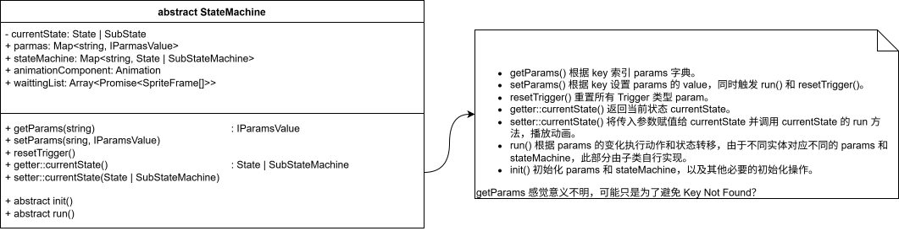
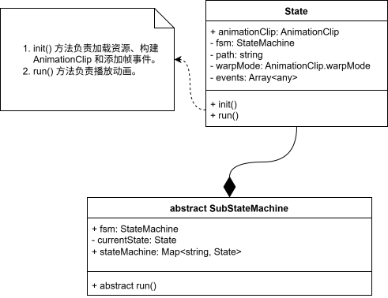
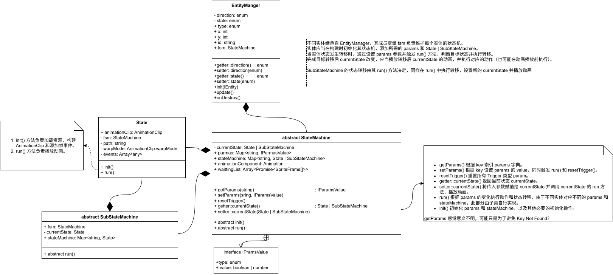

## Cocos 学习之设计模式：以 Cramped Room Of Death 为例

本文基于 [《Cocos 游戏开发》Steam游戏复刻教程 ](https://www.bilibili.com/video/BV1JL4y1M7Y4) ，但是并不涉及 Cocos Creator 的使用细节和 TypeScript 的基础语法等内容，而是专注于项目实现过程中的思想和设计模式。


### 一、资源加载：单例模式

在生成游戏内容时，除了一开始就布置在屏幕上的资源（图片、音乐等）之外，其他资源都是在运行过程中加载并放置的。Cocos 毫无疑问提供了直接从资源目录在加载各种资源的方法。但是对于小型游戏而言，资源的复用率很高。如果我们每次都重复调用加载方法，毫无疑问会浪费很多时间。此时我们就需要建立一个空间来存放这些需要重复使用的资源，进一步的，我们可以创建一个类，所有的资源都使用该类的对象进行加载，加载的资源会持久化的存储在对象中，在必要的时候进行清理，从而以空间换取时间。而这样的类在整个生命周期中只需要存在一个对象即可，重复创建没有实际意义还浪费空间，因此我们可以使用单例模型来建立这样的资源管理对象。

单例模式就是一个类只有一个实例，这个类提供了创建唯一实例的方法和访问这个实例的方法。通常的实现方式是将类的构造方法设置为私有，同时提供一个公有的静态方法 `GetInstance` 来构建实例，该方法负责保证唯一实例的要求。

```typescript
export class Singleton{
    private static _instance: any = null
    
    static GetInstance<T>():T{
        if (this._instance === null){
            this._instance = new this()
        }
        return this._instance
    }
}
```

这里使用了泛型用于指定唯一实例的类型，TypeScript 对于泛型的支持和其他语言不同，因此可能也有其他写法，但形式上是差不多的。

> 为什么要指定唯一实例的类型？
>
> 因为这里的 `Singleton` 只是一个父类，所有希望使用工厂模式的类都可以继承这个类，通过 `super.GetInstance` 方法创建唯一实例。但是父类的方法并不知道子类的数据类型，因此通过泛型指定，可以提高代码的可读性，让 IDE 更好的识别，以及避免一些潜在的问题。

需要注意的是子类继承 `Singleton` 之后需要在自己的类中对外提供访问该静态实例的方法。

```typescript
export default class DataManager extends Singleton {

    static get Instance(){
        return super.GetInstance<DataManager>()
    }

    mapInfo: Array<Array<ITile>>;
    mapRowCount: number;
    mapColumnCount: number;

}
```

例如这里实现的 DataManger 类直接使用 get 关键字提供 `DataManager.Instance` 来访问唯一实例。

我们可以将所有需要使用的资源存放在单例对象中，在需要使用的地方访问该对象以获取资源，从而避免了重复加载，并且为资源管理提供了统一的接口。


### 二、事件处理：发布-订阅模式

当我们点击按钮或者按下按键等操作时，我们希望程序能够给出对应的响应，这种响应往往都是通过事件触发的，即我们的操作发布了一个事件，例如点击事件，这个事件可能绑定了一些函数，当事件触发后程序会依次执行绑定在事件上的函数，从而产生响应。

但是在一个程序中会有很多不同的事件，甚至同一种操作在不同的时刻触发的相同的事件时，会产生不同的响应。如果我们单纯的编写很多绑定代码，那么整个事件的管理就会变得很复杂，因此我们需要一种统一管理事件的模式，例如发布-订阅模式。

发布-订阅模式是一种一对多的依赖关系，非常适合事件处理，因为一个事件往往需要调用多个处理。这个模式将事件的发布者和订阅者分离，通过事件中心统一管理事件的订阅和发布。因此实现的关键就是事件中心。

事件中心通过一个 Map 来管理事件和处理方法之间的关系。提供三个方法来实现发布者，订阅者和事件中心的交互，分别是 `on`、`off` 和 `emit` ，分别实现事件订阅、取消订阅和事件发布。

```typescript
class EventManager{
    
    eventMap: MapM<string, Array<Function>> = new Map()
    
    // 订阅一个事件，将处理方法添加的事件的方法列表中
    on(eventName:string, func:Function){
        if (this.enevtMap.hasName(eventName)){
            this.eventMap.getName(eventName).push(func)
        }else{
            this.eventMap.set(eventName, [func])
        }
    }
    
    // 取消订阅，将对应的处理方法从事件的方法列表中移除
    off(eventName:string, func:Function){
        if (this.eventMap.hasName(eventName)){
            const index = this.eventMap.getName(eventName).findIndex(f => f === func)
            if (index > -1){
                this.eventMap.getName(eventName).splice(index, 1)
            }
        }
    }
    
    // 发布事件，调用事件的整个方法列表
    emit(eventName: string){
        if (this.eventMap.hasName(eventName)){
            this.eventMap.getName(eventName).forEach(f => {f()})
        }
    }
}
```

以上代码是实现的基本思路，但是还存在一些问题。

首先是方法的调用，根据调用者的不同，方法的运行也会不同，而通常我们希望方法的调用者就是订阅这个事件的对象，不同的方法由其对应的对象调用，而不是由事件中心调用，或者根本不知道调用者是谁，导致运行出现问题。为了避免这种情况出现，我们可以在订阅时一并传入方法的上下文，即将订阅事件的对象一起传入，在事件发布时，再使用这个上下文调用对应的方法。

其次是参数问题，我们不可能不依赖参数就处理所有的情况，事件的发布者总是会希望添加一下参数从而控制方法的处理过程。所以我们在发布事件时需要接受来自事件发布者的参数，并将其传递给所有的方法，而方法则按需使用这些参数。

```typescript
interface IItem{ // 定义一个同时保存方法和其上下文的结构
    func:Function,
    ctx:unknow // 方法的调用者的数据类型通常是自定义的类，无法指定特定的数据类型
}

class EventManager{
    
    eventMap: MapM<string, Array<IItem>> = new Map()
    
    // 订阅一个事件，将处理方法添加的事件的方法列表中
    on(eventName:string, func:Fcuntion, ctx:unknow){
        if (this.enevtMap.hasName(eventName)){
            this.eventMap.getName(eventName).push({func, ctx})
        }else{
            this.eventMap.set(eventName, [{func, ctx}])
        }
    }
    
    // 取消订阅，将对应的处理方法从事件的方法列表中移除
    off(eventName:string, func:Function){
        if (this.eventMap.hasName(eventName)){
            const index = this.eventMap.getName(eventName).findIndex(i => i.f === func)
            if (index > -1){
                this.eventMap.getName(eventName).splice(index, 1)
            }
        }
    }
    
    // 发布事件，调用事件的整个方法列表
    emit(eventName: string, ...args: unkown[]){
        if (this.eventMap.hasName(eventName)){
            this.eventMap.getName(eventName).forEach(({fcun, ctx}) => {
      			ctx?func.apply(ctx, args) : func(...args)// 如果带有 ctx 则使用 ctx 调用，否则直接调用
            })
        }
    }
}
```


### 三、有限状态机

有限状态机作为一种编程模式或者说思想，有很多中不同的实现的方法，但是其基本理念只有三个要素：**状态、条件和动作**。状态包含当前实体所有可能的状态，例如对于一个简单的游戏角色来说，可能存在待机、跑动、跳跃、攻击和死亡这五个状态。条件描述了实体在什么情况下执行状态转移，以及对应的目标状态是什么。例如没有任何输入时角色处于待机状态，当接收到方向输入则根据输入选择对应方向的跑动状态，受到攻击则进入死亡状态等。动作则是实体在状态转移过程中需要执行的某些操作，动作并不是必须的，需要根据情况而定。

综上所述，一个状态机应当至少包含如下要素：条件列表、状态图和当前状态。条件列表包含了实体可能触发状态转移的所有条件，状态图则描述了实体的所有状态以及转移关系，当前状态用于确定实体当前所处的状态。

在 Cramped Room Of Death 中，一个状态机基类如下：

 

其中条件列表使用 `params` 表示、状态图使用 `stateMachine` ，具体的状态转移则由 run() 定义。当前状态由 `currentState` 保存。这些参数由 `init()` 方法在状态机初始化过程中完成。

该状态机的执行逻辑为：当使用 `setParams()` 方法改变 `params` 时，调用 `run()` 方法，确定目标状态和需要执行的动作，执行状态转移 `setter::currentState()` ，当前状态变更后播放当前状态的动画以及执行某些动作。

状态图 `stateMachine` 中使用 `State` 和 `SubStateMachine` 类型保存状态。`State` 很好理解，其描述了某一个状态，例如该状态对应的动画和数据等。那什么是 `SubStateMachine` ？实际上某些状态可能属于同一类状态，例如对于一个 2D 角色来说，很多动作例如待机、跑动等都是有方向性的，如果为这样的动作都设置四个状态，那么所需要的状态的个数就会变成四倍，转移关系也会变成四倍。因此为了简化这个过程，我们使用子状态机，来管理属于同一类的状态，具体使用哪个子状态，则有传入子状态机的参数决定。

> 如果 currentState 是一个 SubStateMachine，同样也会在 `setter::currentState()` 时调用其 `run()` 方法，此时子状态机的 `run()` 被调用，其作用实际上和 `StateMachine` 完全一致，根据 params 和传入的参数确定子状态，进行状态转移。需要注意的是，子状态机完全由状态机管理，因此其仅仅保存所需的子状态图，params 列表由状态机维护。



无论转移的目标状态是 `State` 还是 `SubStateMachine` ，最终调用的都是 `State` 的 `run()` 方法，该方法通过其保存的实体 fsm 引用，调用实体的 `Animation` 组件播放动画。

加入实体后我们的整个类图如下所示：

 
